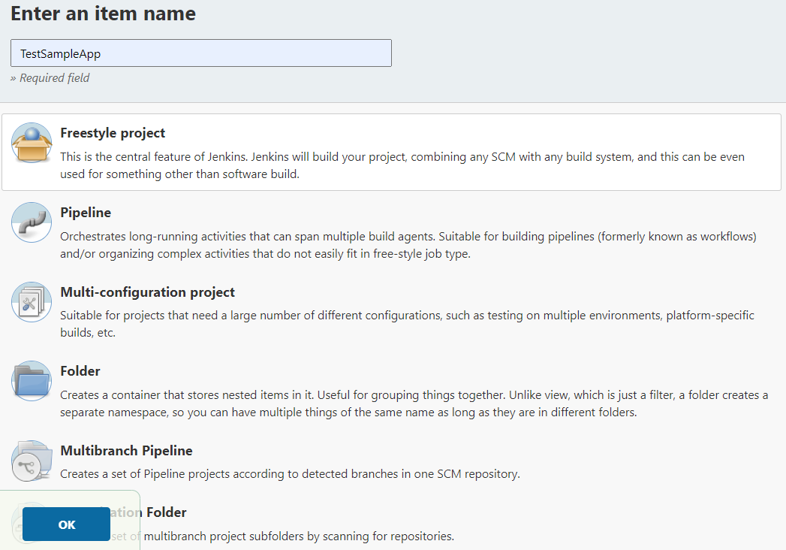
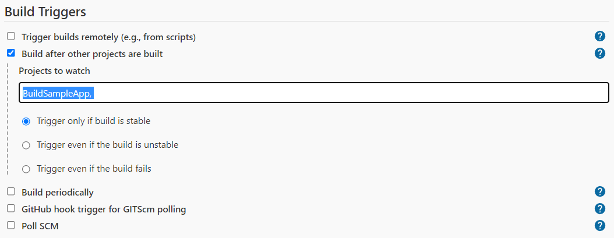

# Lab Report: Continuous Integration/Delivery pipeline with Jenkins

## Build and verify the sample application
1. Log in to the VM with `vagrant ssh` and go to directory `/vagrant/labs/cicd-sample-app`.
```console
$ vagrant ssh dockerlab
Welcome to Ubuntu 20.04.2 LTS (GNU/Linux 5.4.0-80-generic x86_64)
[...]

vagrant@dockerlab:~$ cd /vagrant/labs/cicd-sample-app
```


2. Build the application using the `sample-app.sh` script. The build script will likely not be executable, so keep that in mind. Downloading the image may take a while since it's almost 900 MB. After the build is finished, your application should be running as a Docker container.
```console
vagrant@dockerlab:/vagrant/labs/cicd-sample-app$ ./sample-app.sh
Sending build context to Docker daemon  6.144kB
Step 1/7 : FROM python
 ---> 618fff2bfc18
[...]
Step 7/7 : CMD python /home/myapp/sample_app.py
 ---> Using cache
 ---> 002d47e7010e
Successfully built 002d47e7010e
Successfully tagged sampleapp:latest
646e86e59cdf2cabd4e5724e08b474c0783049f13477fa1082d4d92cdd1c2087
CONTAINER ID   IMAGE                    COMMAND                  CREATED        STATUS                    PORTS                                                      NAMES
646e86e59cdf   sampleapp                "/bin/sh -c 'python …"   1 second ago   Up Less than a second     0.0.0.0:5050->5050/tcp, :::5050->5050/tcp                  samplerunning
```


3. Verify the app by pointing your browser to http://192.168.56.20:5050/. You should see the text "You are calling me from 192.168.56.1" with a blue background.


4. Stop the container and remove it.
```console
vagrant@dockerlab:/vagrant/labs/cicd-sample-app$ docker stop samplerunning
samplerunning

vagrant@dockerlab:/vagrant/labs/cicd-sample-app$ docker rm samplerunning
samplerunning
```

## Download and run the Jenkins Docker image
1. Download the Jenkins image with `docker pull jenkins/jenkins:lts`.
```console
vagrant@dockerlab:/vagrant/labs/cicd-sample-app$ docker pull jenkins/jenkins:lts
lts: Pulling from jenkins/jenkins
955615a668ce: Pull complete
[...]
60f379d61558: Pull complete
Digest: sha256:4b17ea5e222f5fbfcf8d77ac497c6f597ebe5141c39e210dac6c5815485e20a4
Status: Downloaded newer image for jenkins/jenkins:lts
docker.io/jenkins/jenkins:lts

```
2. Start the Jenkins Docker container:
```console
vagrant@dockerlab:/vagrant/labs/cicd-sample-app$ docker run -p 8080:8080 -u root \
>   -v jenkins-data:/var/jenkins_home \
>   -v $(which docker):/usr/bin/docker \
>   -v /var/run/docker.sock:/var/run/docker.sock \
>   -v "$HOME":/home \
>   --name jenkins_server jenkins/jenkins:lts
```

- Port 8080 is exposed and forwarded to the host system
- -u runs the container as root
- The first -v option mounts a volume for keeping persistent data
- The second and third -v makes the Docker command available inside the Jenkins container. It is necessary to run the container as root to make this work (see the -u option).
- The last line specifies a name for the container and the image to be used

3. The container is started in the foreground. It will emit a password for the admin user generated at random. Record this password somewhere, because remembering will be impossible for most people. If you do forget the password, you can retrieve it from a specific file inside the container with the command docker exec -it jenkins_server /bin/cat /var/jenkins_home/secrets/initialAdminPassword)
```console
vagrant@dockerlab:~$ docker exec -it jenkins_server /bin/cat /var/jenkins_home/secrets/initialAdminPassword

0c3e134d937d4f558df3a54833ee0faf
```

## Configure Jenkins
1. Open a browser tab and point it to http://192.168.56.20:8080/. You are asked to enter the administrator password that you recorded in the previous step. 


2. Next, Jenkins will ask which plugins you want to have installed. Choose to install the recommended plugins. After this, Jenkins will initialize, which takes some time. You can follow the progress on the web page.


3. When the initialization process finishes, you are redirected to a page that asks you to create an admin user. For now, you can skip this an continue as admin by following the link at the bottom.


4. On the next page, titled "Instance Configuration", just click "Save and Finish" and then "Start using Jenkins".


## Use Jenkins to build your application

1. On the Jenkins dashboard, click "Create a new job". Enter a suitable name, e.g. BuildSampleApp. Select a "free style project" as job type.


2. The following page allows you to configure the new job. There are a lot of options, so you may be overwhelmed at first.
   - Optionally, enter a description
    

   - In the section "Source Code Management", select the radio button "Git" and enter the https-URL to your Github project, https://github.com/USER/cicd-sample-app.git
   - Since your repository is public it is not necessary to enter credentials.
   - The branch to be built should be */main instead of the default */master
    
  
   - In the section "Build Steps", click "Add a build step" and select "Execute shell" from the dropdown list. enter `bash ./sample-app.sh`
   
   - Click "Save". You are redirected to the Jenkins dashboard

3. The dashboard shows an overview of all build jobs. Click the job you just created and in the menu on the left, start a new build job.
   - Hopefully, the build succeeded. Use the overview of build attempts to view the console output of the build process to. If the build process failed this is where you can find error messages that can help to determine the cause.
  

4. Ensure the application is running by reloading the appropriate browser tab.


## Add a job to test the application
1. Find the IP address of `samplerunning` and `jenkins_server` containers.
```console
vagrant@testlab:~$ docker inspect samplerunning | grep '"IPAddress"'
            "IPAddress": "172.17.0.3",
                    "IPAddress": "172.17.0.3",

vagrant@testlab:~$ docker inspect jenkins_server | grep '"IPAddress"'
            "IPAddress": "172.17.0.2",
                    "IPAddress": "172.17.0.2",
```
- IP address `samplerunning`: 172.17.0.3
- IP address `jenkins_server`: 172.17.0.2

2. On the Jenkins dashboard, click "Create a new job". Enter a suitable name, e.g. TestSampleApp. Select a "free style project" as job type. Optionally, add a description.


3. Under section "Build Triggers", select checkbox "Build after other projects are built". In the text field "Projects to watch", enter the name of the build job.


4. Under sectiuon "Build steps", add a build step of type "Execute shell". Enter the following code:

```console 
curl http://APP_IP:5050/ | grep "You are calling me from JENKINS_IP"
```
replacing APP_IP and JENKINS_IP with the appropriate IP addresses.


5. Save and run the job to verify if it succeeds


    Jenkins can determine whether the job succeeded or failed using the exit status of the command given. When grep finds a matching line in the standard output of curl, it will finish with exit status 0 (indicating succes). If not, it will have exit status 1 (indicating failure). If the command returns a nonzero exit status, it will consider the job to be failed.

    Remark that this is not exactly a full-fledged acceptance test. In a real-life application, you would probably launch a test suite that has to be installed on the Jenkins server.

    You could write a bash script that's a bit more useful than the command specified above. For example, if the job fails, the console output will not give you any clue as to why. In case of a failure to find the expected IP address in the output of curl, you could print the actual output on the console.

5. The Jenkins dashboard should now list both the build and test job. Stop and remove the `samplerunning` container and then launch the build job.
```console
vagrant@testlab:~$ docker stop samplerunning
samplerunning
```


## Create a build pipeline

1. Go to the Jenkins pipeline and create a new item. Enter an appropriate name (e.g. SampleAppPipeline) and select "Pipeline" as job type. Press OK.


2. Optionally, enter a description and in the Pipeline section, enter the following code:
```console
node {
    stage('Preparation') {
        catchError(buildResult: 'SUCCESS') {
            sh 'docker stop samplerunning'
            sh 'docker rm samplerunning'
        }
    }
    stage('Build') {
        build 'BuildSampleApp'
    }
    stage('Results') {
        build 'TestSampleApp'
    }
}
```


3. Next, start a build. Jenkins will show you how each phase of the pipeline progresses. Check the console output of each phase.


4. If the run succeeds, the application should be running. Verify by opening it in a web browser.


## Make a change in the application
1. Go to your local copy of the Git repository with the sample application.

2. Open file static/style.css and change the page background color from "lightsteelblue" into whatever you want.

3. Save the file, commit your changes and push them to Github.

4. In the Jenkins dashboard, launch the build pipeline.
Reload the application in the webbrowser, it should have a different background colour now!

## Resources

List all sources of useful information that you encountered while completing this assignment: books, manuals, HOWTO's, blog posts, etc.

