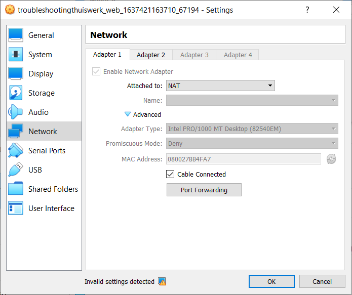
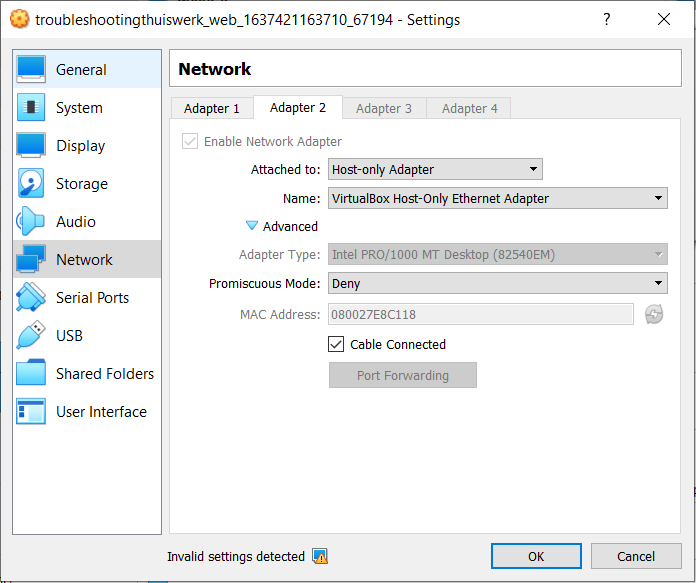
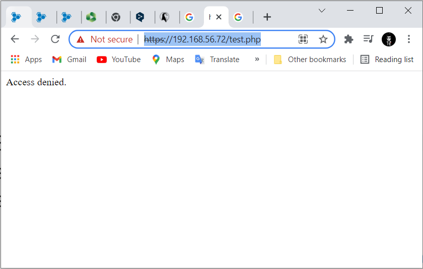
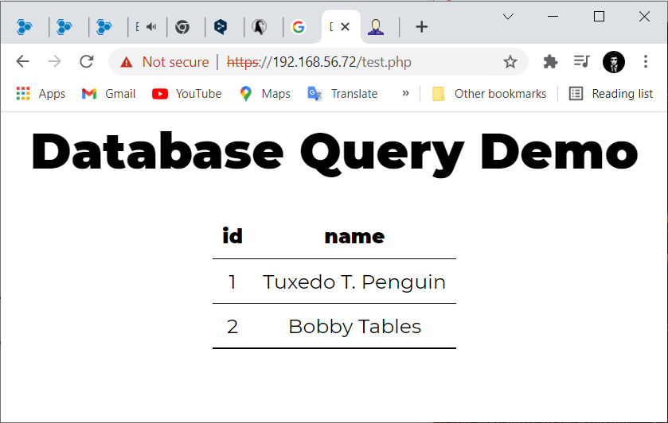

# Lab Report: Troubleshooting
## Before we begin

First we have to set up the test environment for this specific lab exercise.
```console
$ git clone https://github.com/HoGentTIN/infra-demo.git
$ cd infra-demo/troubleshooting
$ vagrant up db web
```

## Our case: web + db server
We have 2 VirtualBox VMs which are set up with Vagrant

| Host | IP | Service
| -- | -- | --| 
| web | 192.168.56.72 | http, https (Apache) |
| db | 192.168.56.73 | mysql (MariaDB)

- On web, a PHP app runs a query on the db
- db is set up correctly, web is **not**

## Our goal
Our goal is to end with this result at the end of the assignment.


## Test the database server

SSH to your database server and test whether the database is functioning. Within the VM navigate to the folder `/vagrant/` and run the `query_db.sh` script.
```console
$ vagrant ssh db

This system is built by the Bento project by Chef Software
More information can be found at https://github.com/chef/bento
Web console: https://db:9090/ or https://10.0.2.15:9090/

[vagrant@db ~]$ cd /vagrant/

[vagrant@db vagrant]$ ls
provisioning  query_db.sh  tests  Vagrantfile  vagrant-hosts.yml  www

[vagrant@db vagrant]$ ./query_db.sh

+ mysql --host=192.168.56.73 --user=demo_user --password=ArfovWap_OwkUfeaf4 demo '--execute=SELECT * FROM demo_tbl;'
+----+-------------------+
| id | name              |
+----+-------------------+
|  1 | Tuxedo T. Penguin |
|  2 | Bobby Tables      |
+----+-------------------+
+ set +x

```

We can extract useful information from the query that we have executed. 
We are executing a mysql command: 

- On host `192.168.56.73`
- As user `demo_user`
- As password `ArfovWap_OwkUfeaf4` 
- On the database `demo`
- Executed sql query `SELECT * FROM demo_tbl;`

## Bottom-up approach
TCP/IP protocol stack

| Layer | Protocols | Keywords | Explanation |
| --    | --        | --       | --          |
| Application | HTTP, DNS, SMB, FTP, ... | | A |
| Transports | TCP, UDP | sockets, port, numbers | B |
| Internet | IP, ICMP | routing, IP address | Here we realize the configuration of IP addresses and routing between different systems or hosts. |
| Network Access | Ethernet | switch, MAC address | D | 
| Physical | | cables | Here we check everything about our hardware and the cables. |

In this report we will step-by-step explore several commands and approaches on how to check whether the server is correctly configured using the bottom-up approach.

## 1. Network Access Layer

| Layer | Protocols | Keywords | Explanation |
| --    | --        | --       | --          |
| Network Access | Ethernet | switch, MAC address | D | 


- Bare Metal


  - In a bare metal environment test whether the `cables` are not broken and the wires are functioning and receiving signals correctly with a cable-tester device.
  - On plugging the cables, check whether the NIC LEDs are glowing on the switches. Don't forget that some switches may support a maximum of 1 Megabit ethernet and have a specific color for each speed. Don't expect a data flow of 1 Gigabit ethernet cable on a switch which cannot support that speed. Therefore it is important to check the color if the NIC LEDs in such cases.

- Virtual Machine (eg. VirtualBox)


  - Some people may assume that this step is not really applicable on virtual environments, they are wrong! Ensuring that the Network Access Layer is correctly configured on virtual environments is a critical step.

1. On VirtualBox go to the settings of the web server and go to the `Network` Tab. Here we have 2 adapters: `NAT` and `Host-only Adapter`.

   - Adapter 1: NAT



-  The NAT Adapter enables us to SSH from our host-system to the Virtual Machine. 
- Ensure that `Cable Connected` is **checkmarked**. 
- If we click the Port-Forwarding button, we can see that our host system reserves port number 2200 to the guest port 22.
   

- We can specify the settings here in a command to as an alternative way to SSH to the machine:

```console
$ ssh -p 2200 vagrant@127.0.0.1

The authenticity of host '[127.0.0.1]:2200 ([127.0.0.1]:2200)' can't be established.
ED25519 key fingerprint is SHA256:OfN1dlQqG1ceLJSwasMIGt/mwWZHWCgbZ0UhgyBDU3c.
This key is not known by any other names
Are you sure you want to continue connecting (yes/no/[fingerprint])? yes

Warning: Permanently added '[127.0.0.1]:2200' (ED25519) to the list of known hosts.
vagrant@127.0.0.1's password: vagrant

This system is built by the Bento project by Chef Software
More information can be found at https://github.com/chef/bento
Web console: https://web:9090/ or https://10.0.2.15:9090/

Last login: Sat Nov 20 15:21:20 2021 from 10.0.2.2
[vagrant@web ~]$
``` 

Or cleaner way without entering the password:
```console
$ ssh -i .vagrant/machines/web/virtualbox/private_key -p 2200 vagrant@127.0.0.1

This system is built by the Bento project by Chef Software
More information can be found at https://github.com/chef/bento
Web console: https://web:9090/ or https://10.0.2.15:9090/

Last login: Sat Nov 20 16:09:18 2021 from 10.0.2.2
[vagrant@web ~]$
```

   - Adapter 2: Host-only Adapter



- Ensure that `Cable Connected` is **checkmarked**. 


1. With the command `ip link` we can see our adapters in the virtual machine. 
```console
[vagrant@web ~]$ ip link
1: lo: <LOOPBACK,UP,LOWER_UP> mtu 65536 qdisc noqueue state UNKNOWN mode DEFAULT group default qlen 1000
    link/loopback 00:00:00:00:00:00 brd 00:00:00:00:00:00
2: eth0: <BROADCAST,MULTICAST,UP,LOWER_UP> mtu 1500 qdisc fq_codel state UP mode DEFAULT group default qlen 1000
    link/ether 08:00:27:bb:4f:a7 brd ff:ff:ff:ff:ff:ff
3: eth1: <BROADCAST,MULTICAST,UP,LOWER_UP> mtu 1500 qdisc fq_codel state UP mode DEFAULT group default qlen 1000
    link/ether 08:00:27:e8:c1:18 brd ff:ff:ff:ff:ff:ff
```
- Our adapters:
  - Adapter 1: eth0
  - Adapter 2: eth1
- BROADCAST indicated that the adapters are **cable cannected**.

3. Let's see what happens if we **uncheck** the `Cable Connected` of one of our adapters in Virtual Box.


```console
[vagrant@web ~]$ ip link
1: lo: <LOOPBACK,UP,LOWER_UP> mtu 65536 qdisc noqueue state UNKNOWN mode DEFAULT group default qlen 1000
    link/loopback 00:00:00:00:00:00 brd 00:00:00:00:00:00
2: eth0: <BROADCAST,MULTICAST,UP,LOWER_UP> mtu 1500 qdisc fq_codel state UP mode DEFAULT group default qlen 1000
    link/ether 08:00:27:bb:4f:a7 brd ff:ff:ff:ff:ff:ff
3: eth1: <NO-CARRIER,BROADCAST,MULTICAST,UP> mtu 1500 qdisc fq_codel state DOWN mode DEFAULT group default qlen 1000
    link/ether 08:00:27:e8:c1:18 brd ff:ff:ff:ff:ff:ff
```
- Adapters:
  - eth0: BROADCAST
  - eth1: NO-CARRIER
- NO-CARRIER indicates that the cable is **not** `cable connected`. In a physical environment this means that our cable is not plugged in.
- Check the `Cable Connected` box again before continueing to the next Layer.

## 2. Internet Layer

| Layer | Protocols | Keywords | Explanation |
| --    | --        | --       | --          |
| Internet | IP, ICMP | routing, IP address | Here we realize the configuration of IP addresses and routing between different systems or hosts. |

### Checklist


1. **Local** network configurating. IP addresing.
2. Routing within the **LAN**.
3. Know the expected values!
   1. In which subnet do I belong?
   2. Which IP addresses do I expect?
   3. How is my system connected to the outside world?
   4. Which router connects the LAN to the outside world?
   5. Which DNS server do I need?

### Local Configuration
#### IP Address

1. Use the command `ip address` and analyze the network interfaces carefully.
```console
[vagrant@web ~]$ ip a
1: lo: <LOOPBACK,UP,LOWER_UP> mtu 65536 qdisc noqueue state UNKNOWN group default qlen 1000
    link/loopback 00:00:00:00:00:00 brd 00:00:00:00:00:00
    inet 127.0.0.1/8 scope host lo
       valid_lft forever preferred_lft forever
    inet6 ::1/128 scope host
       valid_lft forever preferred_lft forever
2: eth0: <BROADCAST,MULTICAST,UP,LOWER_UP> mtu 1500 qdisc fq_codel state UP group default qlen 1000
    link/ether 08:00:27:bb:4f:a7 brd ff:ff:ff:ff:ff:ff
    inet 10.0.2.15/24 brd 10.0.2.255 scope global dynamic noprefixroute eth0
       valid_lft 81084sec preferred_lft 81084sec
    inet6 fe80::475b:973:4f74:1d01/64 scope link noprefixroute
       valid_lft forever preferred_lft forever
3: eth1: <BROADCAST,MULTICAST,UP,LOWER_UP> mtu 1500 qdisc fq_codel state UP group default qlen 1000
    link/ether 08:00:27:e8:c1:18 brd ff:ff:ff:ff:ff:ff
```

- Network interfaces:
  - lo:
    - IPv4
      - 127.0.0.1/8
    - Loopback configured correctly
  - eth0 (NAT):
    - BROADCAST
    - IPv4:
      - 10.0.2.15/24
    - Configured correctly
  - eth1 (Host-only):
    - BROADCAST
    - NO IPv4 address

- Here we can see that the eth1 adapter is not configured with an IP address.

2. Navigate to the folder `/etc/sysconfig/network-scripts/` and show the contents of the folder.
```console
[vagrant@web ~]$ cd /etc/sysconfig/network-scripts/
[vagrant@web network-scripts]$ ls
ifcfg-eth0  ifdown       ifdown-ippp  ifdown-post    ifdown-Team      ifup          ifup-eth   ifup-isdn   ifup-post    ifup-Team      ifup-wireless      network-functions-ipv6
ifcfg-eth1  ifdown-bnep  ifdown-ipv6  ifdown-routes  ifdown-TeamPort  ifup-aliases  ifup-ippp  ifup-plip   ifup-routes  ifup-TeamPort  init.ipv6-global
ifcfg-lo    ifdown-eth   ifdown-isdn  ifdown-sit     ifdown-tunnel    ifup-bnep     ifup-ipv6  ifup-plusb  ifup-sit     ifup-tunnel    network-functions
```

- This folder contains scripts and files which can be used to troubleshoot our network interfaces.
- Let's view the contents of `ifcfg-eth0` and `ifcfg-eth1`.

3. List and analyze the contents of the `ifcfg-eth0` file. 
```console
[vagrant@web network-scripts]$ cat ifcfg-eth0

TYPE=Ethernet
PROXY_METHOD=none
BROWSER_ONLY=no
BOOTPROTO=dhcp
DEFROUTE=yes
IPV4_FAILURE_FATAL=no
IPV6INIT=yes
IPV6_AUTOCONF=yes
IPV6_DEFROUTE=yes
IPV6_FAILURE_FATAL=no
IPV6_ADDR_GEN_MODE=stable-privacy
NAME=eth0
DEVICE=eth0
ONBOOT=yes
```

- BOOTPROTO=dhcp 
  - The protocol we use for assigning the IP addres..
- NAME=eth0 
  - Name of the interface (eth0) connected to eth0.
- ONBOOT=yes
  - Starts on every boot-up.
- So far everything looks fine with `eth0`.

4. Next, list and analyze the contents of the `ifcfg-eth1` file.
```console
[vagrant@web network-scripts]$ cat ifcfg-eth1

#VAGRANT-BEGIN
# The contents below are automatically generated by Vagrant. Do not modify.
NM_CONTROLLED=yes
BOOTPROTO=none
ONBOOT=yes
IPADDR=192.168.56.72
NETMASK=255.255.255.0
DEVICE=eth1
PEERDNS=no
#VAGRANT-END
```

- BOOTPROTO=none
  - Indicates that we have a static-ip.
- ONBOOT=yes
  - Starts on every boot-up.
- IPADDR=192.168.56.72
  - Configuration of our IP address (Class-C). Looks correctly configured.
- NETMASK=255.255.255.0
  - Configuration of our network mask. Looks correctly configured.
- DEVICE=eth1
  - Name of the interface connected to eth1.
- So far everything looks correctly configured, but we don't have an IP address for the `eth1`. 

5. We have analyzed the configurations of our network interfaces. On normal occassions our IP addresses should be correctly configured on every boot-up, but that's not the case here. So we can assume that somehow someone has manually tinkered with the configuration of the IP address. 


6. Best we can do is restart our network services and see whether it fixes our problem or not. Restart the network services with `systemctl restart network` and see whether it fixes our problem or not.
```console
[vagrant@web network-scripts]$ sudo systemctl restart network

[vagrant@web network-scripts]$ ip a

1: lo: <LOOPBACK,UP,LOWER_UP> mtu 65536 qdisc noqueue state UNKNOWN group default qlen 1000
    link/loopback 00:00:00:00:00:00 brd 00:00:00:00:00:00
    inet 127.0.0.1/8 scope host lo
       valid_lft forever preferred_lft forever
    inet6 ::1/128 scope host
       valid_lft forever preferred_lft forever
2: eth0: <BROADCAST,MULTICAST,UP,LOWER_UP> mtu 1500 qdisc fq_codel state UP group default qlen 1000
    link/ether 08:00:27:bb:4f:a7 brd ff:ff:ff:ff:ff:ff
    inet 10.0.2.15/24 brd 10.0.2.255 scope global dynamic noprefixroute eth0
       valid_lft 80758sec preferred_lft 80758sec
    inet6 fe80::475b:973:4f74:1d01/64 scope link noprefixroute
       valid_lft forever preferred_lft forever
3: eth1: <BROADCAST,MULTICAST,UP,LOWER_UP> mtu 1500 qdisc fq_codel state UP group default qlen 1000
    link/ether 08:00:27:e8:c1:18 brd ff:ff:ff:ff:ff:ff
    inet 192.168.56.72/24 brd 192.168.56.255 scope global noprefixroute eth1
       valid_lft forever preferred_lft forever
    inet6 fe80::a00:27ff:fee8:c118/64 scope link
```

- We can see that our `eth1` interface has gotten an IP address. Restarting our network services has fixed our problem.

#### IP Route

1. Use the command `ip route` to show the routing table and analyze it's contents.
```console
[vagrant@web network-scripts]$ ip route

default via 10.0.2.2 dev eth0 proto dhcp metric 100
10.0.2.0/24 dev eth0 proto kernel scope link src 10.0.2.15 metric 100
192.168.56.0/24 dev eth1 proto kernel scope link src 192.168.56.72 metric 101
```

- The default 10.0.2.2 is the IP address of the router which you're connected to.
- Always ensure that the default gateway is present in the routing table.

2. Check whether the addresses in your routing table are in the same subnet. Compare them with the output of the command `ip address`.
```console
[vagrant@web network-scripts]$ ip route

default via 10.0.2.2 dev eth0 proto dhcp metric 100
10.0.2.0/24 dev eth0 proto kernel scope link src 10.0.2.15 metric 100
192.168.56.0/24 dev eth1 proto kernel scope link src 192.168.56.72 metric 101

[vagrant@web network-scripts]$ ip a
1: lo: <LOOPBACK,UP,LOWER_UP> mtu 65536 qdisc noqueue state UNKNOWN group default qlen 1000
    link/loopback 00:00:00:00:00:00 brd 00:00:00:00:00:00
    inet 127.0.0.1/8 scope host lo
       valid_lft forever preferred_lft forever
    inet6 ::1/128 scope host
       valid_lft forever preferred_lft forever
2: eth0: <BROADCAST,MULTICAST,UP,LOWER_UP> mtu 1500 qdisc fq_codel state UP group default qlen 1000
    link/ether 08:00:27:bb:4f:a7 brd ff:ff:ff:ff:ff:ff
    inet 10.0.2.15/24 brd 10.0.2.255 scope global dynamic noprefixroute eth0
       valid_lft 76235sec preferred_lft 76235sec
    inet6 fe80::475b:973:4f74:1d01/64 scope link noprefixroute
       valid_lft forever preferred_lft forever
3: eth1: <BROADCAST,MULTICAST,UP,LOWER_UP> mtu 1500 qdisc fq_codel state UP group default qlen 1000
    link/ether 08:00:27:e8:c1:18 brd ff:ff:ff:ff:ff:ff
    inet 192.168.56.72/24 brd 192.168.56.255 scope global noprefixroute eth1
       valid_lft forever preferred_lft forever
    inet6 fe80::a00:27ff:fee8:c118/64 scope link
       valid_lft forever preferred_lft forever
```
- eth0
  - ip route: 
    - 10.0.2.0/24
  - ip address: 
    - 10.0.2.15/24
  - Correct subnet
- eth1
  - ip route: 
    - 192.168.56.0/24
  - ip address:
    - 192.168.56.72/24
  - Correct subnet

- The addresses are correct and belong in the same subnet.

#### DNS Service

1. Let's look whether we're connected to a DNS server. Show the output of the `/etc/resolv.conf` file.
```console
[vagrant@web network-scripts]$ cat /etc/resolv.conf
# Generated by NetworkManager
search lan
nameserver 10.0.2.3
options single-request-reopen
```
- Note: this address is simulated and generated by Virtual Box itself.
- We have a DNS server to which we can ask IP addresses for hostnames.
- We have a `nameserver` option present with the `IP` of 10.0.2.3
- Ensure that you atleast have 1 line of nameserver available as a DNS!

#### Ping

1. Ping between hosts, default GW and DNS to ensure that you can route successfully within the LAN. 

2. Ping from your `host system` to the `VM`.
```console
C:\Users\Ismail>ping 192.168.56.72

Pinging 192.168.56.72 with 32 bytes of data:
Reply from 192.168.56.72: bytes=32 time<1ms TTL=64
Reply from 192.168.56.72: bytes=32 time<1ms TTL=64
Reply from 192.168.56.72: bytes=32 time<1ms TTL=64
Reply from 192.168.56.72: bytes=32 time<1ms TTL=64

Ping statistics for 192.168.56.72:
    Packets: Sent = 4, Received = 4, Lost = 0 (0% loss),
Approximate round trip times in milli-seconds:
    Minimum = 0ms, Maximum = 0ms, Average = 0ms
```

2. Ping from your `VM` to your `host system`.

Note: This may not work if your host system is running on Windows. The firewall may block the ICMP packets. Disable the firewall on Windows before pinging to the host system.

```console
[vagrant@web network-scripts]$ ping 192.168.56.1
PING 192.168.56.1 (192.168.56.1) 56(84) bytes of data.
64 bytes from 192.168.56.1: icmp_seq=1 ttl=128 time=0.252 ms
64 bytes from 192.168.56.1: icmp_seq=2 ttl=128 time=0.318 ms
64 bytes from 192.168.56.1: icmp_seq=3 ttl=128 time=0.326 ms
^C
--- 192.168.56.1 ping statistics ---
3 packets transmitted, 3 received, 0% packet loss, time 2040ms
rtt min/avg/max/mdev = 0.252/0.298/0.326/0.038 ms
```

3. Ping from your `VM` to the `Default Gateway`.
```console
[vagrant@web network-scripts]$ ping 10.0.2.2
PING 10.0.2.2 (10.0.2.2) 56(84) bytes of data.
64 bytes from 10.0.2.2: icmp_seq=1 ttl=64 time=0.258 ms
64 bytes from 10.0.2.2: icmp_seq=2 ttl=64 time=0.303 ms
64 bytes from 10.0.2.2: icmp_seq=3 ttl=64 time=0.295 ms
^C
--- 10.0.2.2 ping statistics ---
3 packets transmitted, 3 received, 0% packet loss, time 2072ms
rtt min/avg/max/mdev = 0.258/0.285/0.303/0.023 ms
```

4. Ping from your `VM` to the `DNS Server`.
```console
[vagrant@web network-scripts]$ ping 10.0.2.3
PING 10.0.2.3 (10.0.2.3) 56(84) bytes of data.
64 bytes from 10.0.2.3: icmp_seq=1 ttl=64 time=0.233 ms
64 bytes from 10.0.2.3: icmp_seq=2 ttl=64 time=0.222 ms
64 bytes from 10.0.2.3: icmp_seq=3 ttl=64 time=0.163 ms
^C
--- 10.0.2.3 ping statistics ---
3 packets transmitted, 3 received, 0% packet loss, time 2060ms
rtt min/avg/max/mdev = 0.163/0.206/0.233/0.030 ms
```

5. Ensure that the `DNS` is able to answer to your queries. This can be done with several commands:
   1. dig
```console
[vagrant@web network-scripts]$ dig icanhazip.com

; <<>> DiG 9.11.26-RedHat-9.11.26-6.el8 <<>> icanhazip.com
;; global options: +cmd
;; Got answer:
;; ->>HEADER<<- opcode: QUERY, status: NOERROR, id: 57710
;; flags: qr rd ra ad; QUERY: 1, ANSWER: 2, AUTHORITY: 0, ADDITIONAL: 1

;; OPT PSEUDOSECTION:
; EDNS: version: 0, flags:; udp: 512
;; QUESTION SECTION:
;icanhazip.com.                 IN      A

;; ANSWER SECTION:
icanhazip.com.          284     IN      A       104.18.114.97
icanhazip.com.          284     IN      A       104.18.115.97

;; Query time: 19 msec
;; SERVER: 10.0.2.3#53(10.0.2.3)
;; WHEN: Sat Nov 20 18:35:14 UTC 2021
;; MSG SIZE  rcvd: 74
```

   2. nslookup
```console
[vagrant@web network-scripts]$ nslookup icanhazip.com
Server:         10.0.2.3
Address:        10.0.2.3#53

Non-authoritative answer:
Name:   icanhazip.com
Address: 104.18.115.97
Name:   icanhazip.com
Address: 104.18.114.97
Name:   icanhazip.com
Address: 2606:4700::6812:7361
Name:   icanhazip.com
Address: 2606:4700::6812:7261
```

   3. getent ahosts
```console
getent ahosts icanhazip.com
104.18.114.97   STREAM icanhazip.com
104.18.114.97   DGRAM
104.18.114.97   RAW
104.18.115.97   STREAM
104.18.115.97   DGRAM
104.18.115.97   RAW
2606:4700::6812:7261 STREAM
2606:4700::6812:7261 DGRAM
2606:4700::6812:7261 RAW
2606:4700::6812:7361 STREAM
2606:4700::6812:7361 DGRAM
2606:4700::6812:7361 RAW
```

Note: `dig` and `nslookup` will only work if the `bind-util` package is installed. This can be controlled with with the command `rpm -q bind-utils`.
```console
[vagrant@web network-scripts]$ rpm -q bind-utils

bind-utils-9.11.26-6.el8.x86_64
```

#### Routing beyond GW
1. Use the `curl` to see if you get the html code back from the DNS server.
```console
[vagrant@web network-scripts]$ curl icanhazip.com
193.121.54.175
```

2. Use the `tracepath` to see which networks you go through till the destination address.
```console

```

## 3. Transport Layer

| Layer | Protocols | Keywords | Explanation |
| --    | --        | --       | --          |
| Transports | TCP, UDP | sockets, port, numbers | B |

### Checklist
After our routing is complete, is it important to check whether our services are available on the Transport Layer.

1. Are our services running?
2. Is it using the correct port/interface?
3. Does the firewall allow traffic to the ports?

#### Is the service running?
1. Use the command `systemctl list-units --type=service` to list the `active` services on your system.
```console
[vagrant@web network-scripts]$ systemctl list-units --type=service
UNIT                               LOAD   ACTIVE SUB     DESCRIPTION
atd.service                        loaded active running Job spooling tools
auditd.service                     loaded active running Security Auditing Service
chronyd.service                    loaded active running NTP client/server
crond.service                      loaded active running Command Scheduler
dbus.service                       loaded active running D-Bus System Message Bus
dracut-shutdown.service            loaded active exited  Restore /run/initramfs on sh>
firewalld.service                  loaded active running firewalld - dynamic firewall>
getty@tty1.service                 loaded active running Getty on tty1
gssproxy.service                   loaded active running GSSAPI Proxy Daemon
import-state.service               loaded active exited  Import network configuration>
irqbalance.service                 loaded active running irqbalance daemon
kdump.service                      loaded active exited  Crash recovery kernel arming
kmod-static-nodes.service          loaded active exited  Create list of required stat>
network.service                    loaded active exited  LSB: Bring up/down networking
[...]
```

- This command only displays the currenctly `active` services.

2. List all the services (including disabled) by adding the option `all` to the previous command.
```console
[vagrant@web network-scripts]$ systemctl list-units --type=service --all
  UNIT                                     LOAD      ACTIVE   SUB     DESCRIPTION
  atd.service                              loaded    active   running Job spooling tools
  auditd.service                           loaded    active   running Security Auditing Service
  auth-rpcgss-module.service               loaded    inactive dead    Kernel Module supporting RPCSEC_GSS
  chronyd.service                          loaded    active   running NTP client/server
  cockpit-motd.service                     loaded    inactive dead    Cockpit motd updater service
  cockpit-wsinstance-http-redirect.service loaded    inactive dead    Cockpit Web Service http-redirect instance
  cockpit-wsinstance-http.service          loaded    inactive dead    Cockpit Web Service http instance
  cockpit.service                          loaded    inactive dead    Cockpit Web Service
  cpupower.service                         loaded    inactive dead    Configure CPU power related settings
  crond.service                            loaded    active   running Command Scheduler
  dbus.service                             loaded    active   running D-Bus System Message Bus
● display-manager.service                  not-found inactive dead    display-manager.service
[...]
```

3. Now that we know how to list the services, check the status of the `httpd` service.
```console
[vagrant@web network-scripts]$ systemctl status httpd
● httpd.service - The Apache HTTP Server
   Loaded: loaded (/usr/lib/systemd/system/httpd.service; disabled; vendor preset: disabled)
  Drop-In: /usr/lib/systemd/system/httpd.service.d
           └─php-fpm.conf
   Active: inactive (dead)
     Docs: man:httpd.service(8)
```

- We can see that the `httpd` Apache service is disabled. We must enable this service to ensure that at the end of this exercise we can reach the desired website succesfully.

4. Enable/start the `httpd` service.
```console
[vagrant@web network-scripts]$ sudo systemctl start httpd

[vagrant@web network-scripts]$ systemctl status httpd

● httpd.service - The Apache HTTP Server
   Loaded: loaded (/usr/lib/systemd/system/httpd.service; disabled; vendor preset: disabled)
  Drop-In: /usr/lib/systemd/system/httpd.service.d
           └─php-fpm.conf
   Active: active (running) since Sat 2021-11-20 19:01:17 UTC; 25s ago
     Docs: man:httpd.service(8)
 Main PID: 6996 (httpd)
   Status: "Running, listening on: port 443, port 8080"
    Tasks: 213 (limit: 4949)
   Memory: 32.0M
   CGroup: /system.slice/httpd.service
           ├─6996 /usr/sbin/httpd -DFOREGROUND
           ├─6999 /usr/sbin/httpd -DFOREGROUND
           ├─7000 /usr/sbin/httpd -DFOREGROUND
           ├─7001 /usr/sbin/httpd -DFOREGROUND
           └─7002 /usr/sbin/httpd -DFOREGROUND
```

#### Does our service listen to the correct ports/interfaces?

1. Use the `ss` command to display the the `TCP services`.
- tlnp
  - t: TCP
  - l: listening ports
  - n: port numbers
  - p: processes
```console
[vagrant@web network-scripts]$ sudo ss -tlnp
State        Recv-Q       Send-Q             Local Address:Port             Peer Address:Port      Process
LISTEN       0            128                      0.0.0.0:111                   0.0.0.0:*          users:(("rpcbind",pid=632,fd=4),("systemd",pid=1,fd=41))
LISTEN       0            128                      0.0.0.0:22                    0.0.0.0:*          users:(("sshd",pid=712,fd=4))
LISTEN       0            128                         [::]:111                      [::]:*          users:(("rpcbind",pid=632,fd=6),("systemd",pid=1,fd=45))
LISTEN       0            128                            *:8080                        *:*          users:(("httpd",pid=7002,fd=4),("httpd",pid=7001,fd=4),("httpd",pid=7000,fd=4),("httpd",pid=6996,fd=4))
LISTEN       0            128                         [::]:22                       [::]:*          users:(("sshd",pid=712,fd=6))
LISTEN       0            128                            *:443                         *:*          users:(("httpd",pid=7002,fd=8),("httpd",pid=7001,fd=8),("httpd",pid=7000,fd=8),("httpd",pid=6996,fd=8))
LISTEN       0            128                            *:9090                        *:*          users:(("systemd",pid=1,fd=61))
```

- We can extract that the `httpd` service is listening to port `8080` and `443 (HTTPS)`. The first port `8080` is the root cause why we can't reach the web server from our host system. Port number `8080` should be set correctly as `80 (HTTP)`. 

2. List the directory structure of `/etc/httpd/`.
 ```console
[vagrant@web network-scripts]$ tree /etc/httpd/
/etc/httpd/
├── conf
│   ├── httpd.conf
│   └── magic
├── conf.d
│   ├── autoindex.conf
│   ├── php.conf
│   ├── README
│   ├── ssl.conf
│   ├── userdir.conf
│   └── welcome.conf
├── conf.modules.d
│   ├── 00-base.conf
│   ├── 00-dav.conf
│   ├── 00-lua.conf
│   ├── 00-mpm.conf
│   ├── 00-optional.conf
│   ├── 00-proxy.conf
│   ├── 00-ssl.conf
│   ├── 00-systemd.conf
│   ├── 01-cgi.conf
│   ├── 10-h2.conf
│   ├── 10-proxy_h2.conf
│   ├── 15-php.conf
│   └── README
├── logs -> ../../var/log/httpd
├── modules -> ../../usr/lib64/httpd/modules
├── run -> /run/httpd
└── state -> ../../var/lib/httpd

7 directories, 21 files
``` 

- The file where we need to adjust the port number is /etc/httpd/conf/httpd.conf

3. Change the port number from `8080` to `80` in `/etc/httpd/conf/httpd.conf` with vim.
```console
[vagrant@web network-scripts]$ sudo vim /etc/httpd/conf/httpd.conf +/8080

[Changing 8080 to 80 with VIM editor]
```

4. Restart the `httpd` service to apply the changes. Do not skip this step!
```console
[vagrant@web network-scripts]$ sudo systemctl restart httpd
```

#### Firewall settings

1. Use the `firewall-cmd --list-all` command to view the firewall rules.
```console
[vagrant@web network-scripts]$ sudo firewall-cmd --list-all
public (active)
  target: default
  icmp-block-inversion: no
  interfaces: eth0 eth1
  sources:
  services: cockpit dhcpv6-client ssh
  ports:
  protocols:
  masquerade: no
  forward-ports:
  source-ports:
  icmp-blocks:
  rich rules:
```

- At the line `services`, we see that `http` and `https` services are not mentioned in the firewall rules. We need to add those services to the firewall rules to allow traffic.

2. Add the services `http` and `https` permanently to the firewall.
```console
[vagrant@web network-scripts]$ sudo firewall-cmd --add-service http --permanent
success
[vagrant@web network-scripts]$ sudo firewall-cmd --add-service https --permanent
success
```

3. Restart the `firewall` rules to apply the changes. Do not skip this step!
```console
[vagrant@web network-scripts]$ sudo firewall-cmd --reload
success
```

4. Ensure that both of the services are added to the firewall-rules.
```console
[vagrant@web network-scripts]$ sudo firewall-cmd --list-all
public (active)
  target: default
  icmp-block-inversion: no
  interfaces: eth0 eth1
  sources:
  services: cockpit dhcpv6-client http https ssh
  ports:
  protocols:
  masquerade: no
  forward-ports:
  source-ports:
  icmp-blocks:
  rich rules:
```

## 4. Application Layer

| Layer | Protocols | Keywords | Explanation |
| --    | --        | --       | --          |
| Application | HTTP, DNS, SMB, FTP, ... | | A |


1. Ensure that the journalctl logs is continuosly up on a seperate window to see which errors you make throughout a configuration.

2. Validate the syntax of the config file of the service. For apache it is `apachectl configtest`.
```console
[vagrant@web network-scripts]$ apachectl configtest

AH00558: httpd: Could not reliably determine the server's fully qualified domain name, using 127.0.1.1. Set the 'ServerName' directive globally to suppress this message
Syntax OK
```

3. Use CLI client tools (curl, smbclient, dig, ncat, nc, ...)

4. Other checks are application dependent, read the manuals!

## SELinux troubleshooting

1. Let's navigate to https://192.168.56.72/test.php on our host system and see what it returns.


- We get an Access denied message. 

2. Let's navigate to the folder `/var/www/html/` and advance list the contents.
```console
[vagrant@web network-scripts]$ cd /var/www/html/

[vagrant@web html]$ ls -l
total 4
-rwxr-xr-x. 1 root root 1339 Nov 20 15:16 test.php
```

- Interesting, the file is readable for everyone, but we cannot view it on our host system.

3. Let's run the script with the command `php`.
```console
[vagrant@web html]$ php test.php

<html>
<head>
<title>Demo</title>
<link href="https://fonts.googleapis.com/css2?family=Montserrat:wght@400;900&display=swap" rel="stylesheet">
<style>
table, th, td {
  border-bottom: 1px solid black;
  padding: 10px;
  border-collapse: collapse;
  text-align: center;
}
.center {
  margin-left: auto;
  margin-right: auto;
}
h1 {
  text-align: center;
  font-size: 50px;
}
* {
  font-family: Montserrat;
  font-size: 20px;

}
</style>
</head>
<body>
<h1>Database Query Demo</h1>

<table class="center">
        <tr><th>id</th><th>name</th></tr>
        <tr>
                <td>1</td>
                <td>Tuxedo T. Penguin</td>
        </tr>
        <tr>
                <td>2</td>
                <td>Bobby Tables</td>
        </tr>
</table>
</body>
```

- There are no problems with running the script.

4. This is caused by SELinux. SELinux (Security Enhanced Linux) is a Mandatory Access Control which runs in the Linux kernel that offers extra security. This is default installed on Red Hat system. 

5. Display the status of SELinux with the command `sestatus`. 
```console
[vagrant@web html]$ sestatus
SELinux status:                 enabled
SELinuxfs mount:                /sys/fs/selinux
SELinux root directory:         /etc/selinux
Loaded policy name:             targeted
Current mode:                   enforcing
Mode from config file:          enforcing
Policy MLS status:              enabled
Policy deny_unknown status:     allowed
Memory protection checking:     actual (secure)
Max kernel policy version:      33
```

6. Display the files in the current directory along with the option `-lZ`. Z is for SELinux permissions context.
```console
[vagrant@web html]$ ls -lZ
total 4
-rwxr-xr-x. 1 root root unconfined_u:object_r:user_home_t:s0 1339 Nov 20 15:16 test.php
```

- We see that the context of the file is `user_home_t`. This is the root cause why we couldn't access test.php on our browser. We need to adjust the correct context. 
- We can either use `sudo restorecon -R /var/www/` or `sudo chcon -t httpd_sys_content_t test.php`.

7. Use the command `sudo restorecon -R /var/www/` to restore all the files to it's original context in the directory `/var/www/`.
```console
[vagrant@web html]$ sudo restorecon -R /var/www/
```

8. On your host system refresh the page to test.php.


- We can see the page, but we're not there yet. We have could not connect to the database server. 

9. Get the SE booleans for http.
```console
[vagrant@web html]$ getsebool -a | grep httpd
httpd_anon_write --> off
httpd_builtin_scripting --> on
httpd_can_check_spam --> off
httpd_can_connect_ftp --> off
httpd_can_connect_ldap --> off
httpd_can_connect_mythtv --> off
httpd_can_connect_zabbix --> off
httpd_can_network_connect --> off
httpd_can_network_connect_cobbler --> off
httpd_can_network_connect_db --> off
[...]
```

- We see that httpd cannot network connect to the db at the last line. That option is turned off.  This option is the reason why we couldn't connect to the database server. 
- If the database server was running locally on the server, we wouldn't be confronted with this problem, because then we don't have to go over the network for the database. 

10. Permanently enable the `httpd_can_network_connect_db`.
```console
[vagrant@web html]$ sudo setsebool -P httpd_can_network_connect_db on


[vagrant@web html]$ getsebool -a | grep httpd
httpd_anon_write --> off
httpd_builtin_scripting --> on
httpd_can_check_spam --> off
httpd_can_connect_ftp --> off
httpd_can_connect_ldap --> off
httpd_can_connect_mythtv --> off
httpd_can_connect_zabbix --> off
httpd_can_network_connect --> off
httpd_can_network_connect_cobbler --> off
httpd_can_network_connect_db --> on
[...]
```
- We see that `httpd_can_network_connect_db` has been turned on.

10. Refresh once again the website to see if we can connect to the db.


11. We can also create policies instead of setting the files to the expected context.


## Resources

List all sources of useful information that you encountered while completing this assignment: books, manuals, HOWTO's, blog posts, etc.
```console

```