# Lab Report: Configuration Management with Ansible

The goal of this assignment is to set up a complete local network (domain name `infra.lan`) with some typical services: a web application server (e.g. to host an intranet site), DHCP and DNS. A router will connect the LAN to the Internet. The table below lists the hosts in this network:

| Host name         | Alias | IP             | Function         |
| :---------------- | :---- | :------------- | :--------------- |
| (physical system) |       | 172.16.0.1     | Your physical pc |
| r001              | gw    | 172.16.255.254 | Router           |
| srv001            | ns    | 172.16.128.2   | DNS              |
| srv003            | dhcp  | 172.16.128.3   | DHCP server      |
| srv010            | www   | 172.16.128.10  | Webserver        |
| ws0001            |       | (DHCP)         | workstation      |

## 1. Set up the lab environment

1. Navigate to the `vmlab` directory and view the status of the environment. Currently our environment consists of one VM namly `srv010`. This is our web server. 

```console
$ vagrant status
Current machine states:

srv010                    not created (virtualbox)

The environment has not yet been created. Run `vagrant up` to
create the environment. If a machine is not created, only the
default provider will be shown. So if a provider is not listed,
then the machine is not created for that environment.
```

2. Start the Vagrant environment. We see from the alst lines of the output that an Ansible Playbook was run.

```console
$ vagrant up
Bringing machine 'srv010' up with 'virtualbox' provider...
==> srv010: Importing base box 'bento/almalinux-8'...
==> srv010: Matching MAC address for NAT networking...
==> srv010: Checking if box 'bento/almalinux-8' version '202109.10.0' is up to date...
==> srv010: Setting the name of the VM: vmlab_srv010_1638718125295_37991
==> srv010: Clearing any previously set network interfaces...
==> srv010: Preparing network interfaces based on configuration...
    srv010: Adapter 1: nat
    srv010: Adapter 2: hostonly
==> srv010: Forwarding ports...
    srv010: 22 (guest) => 2222 (host) (adapter 1)
==> srv010: Running 'pre-boot' VM customizations...
==> srv010: Booting VM...
==> srv010: Waiting for machine to boot. This may take a few minutes...
    srv010: SSH address: 127.0.0.1:2222
    srv010: SSH username: vagrant
    srv010: SSH auth method: private key
    srv010:
    srv010: Vagrant insecure key detected. Vagrant will automatically replace
    srv010: this with a newly generated keypair for better security.
    srv010:
    srv010: Inserting generated public key within guest...
    srv010: Removing insecure key from the guest if it's present...
    srv010: Key inserted! Disconnecting and reconnecting using new SSH key...
==> srv010: Machine booted and ready!
==> srv010: Checking for guest additions in VM...
==> srv010: Setting hostname...
==> srv010: Configuring and enabling network interfaces...
==> srv010: Mounting shared folders...
    srv010: /vagrant => C:/Users/Ismail/Documents/School/Infrastructure Automation/infra-2122-IsmailKarakayaa/vmlab
==> srv010: Running provisioner: ansible_local...
    srv010: Installing Ansible...
    srv010: Running ansible-playbook...

PLAY [all] *********************************************************************

TASK [Gathering Facts] *********************************************************
ok: [srv010]
[WARNING]: Platform linux on host srv010 is using the discovered Python
interpreter at /usr/bin/python3.6, but future installation of another Python
interpreter could change this. See https://docs.ansible.com/ansible/2.9/referen
ce_appendices/interpreter_discovery.html for more information.

PLAY RECAP *********************************************************************
srv010                     : ok=1    changed=0    unreachable=0    failed=0    skipped=0    rescued=0    ignored=0
```

3. Look at the `site.yml` playbook in the subdirectory `vmlab/ansible/site.yml`. Currently this playbook is empty. Nothing really happens (`changed=0`).

```console
# site.yml
---
- hosts: all
  roles: []
```

4. Log in to the VM.

```console
$ vagrant ssh srv010

This system is built by the Bento project by Chef Software
More information can be found at https://github.com/chef/bento
[vagrant@srv010 ~]$
```

5. What are the IP addresses of this VM?

```console
[vagrant@srv010 ~]$ ip a
1: lo: <LOOPBACK,UP,LOWER_UP> mtu 65536 qdisc noqueue state UNKNOWN group default qlen 1000
    link/loopback 00:00:00:00:00:00 brd 00:00:00:00:00:00
    inet 127.0.0.1/8 scope host lo
       valid_lft forever preferred_lft forever
    inet6 ::1/128 scope host
       valid_lft forever preferred_lft forever
2: eth0: <BROADCAST,MULTICAST,UP,LOWER_UP> mtu 1500 qdisc fq_codel state UP group default qlen 1000
    link/ether 08:00:27:bb:4f:a7 brd ff:ff:ff:ff:ff:ff
    inet 10.0.2.15/24 brd 10.0.2.255 scope global dynamic noprefixroute eth0
       valid_lft 86005sec preferred_lft 86005sec
    inet6 fe80::7ad2:bca1:918b:8c4f/64 scope link noprefixroute
       valid_lft forever preferred_lft forever
3: eth1: <BROADCAST,MULTICAST,UP,LOWER_UP> mtu 1500 qdisc fq_codel state UP group default qlen 1000
    link/ether 08:00:27:b9:3e:bf brd ff:ff:ff:ff:ff:ff
    inet 172.16.128.10/16 brd 172.16.255.255 scope global noprefixroute eth1
       valid_lft forever preferred_lft forever
    inet6 fe80::a00:27ff:feb9:3ebf/64 scope link
       valid_lft forever preferred_lft forever
```

- Loopback: 127.0.0.1/8
- NAT: 10.0.2.15/24
- Host only: 172.16.128.10/16

6. Check which Linux distribution this VM is running.
 
```console
[vagrant@srv010 ~]$ lsb_release -a
LSB Version:    :core-4.1-amd64:core-4.1-noarch
Distributor ID: AlmaLinux
Description:    AlmaLinux release 8.4 (Electric Cheetah)
Release:        8.4
Codename:       ElectricCheetah
```

AlmaLinux OS is an open-source, community-driven Linux operating system that fills the gap left by the discontinuation of the CentOS Linux stable release. AlmaLinux OS is a 1:1 binary compatible fork of RHEL® guided and built by the community.

As a standalone, completely free OS, AlmaLinux OS enjoys $1M in annual sponsorship from CloudLinux Inc and support from other sponsors. Ongoing development efforts are governed by the members of the community.

The AlmaLinux OS Foundation is a 501(c)(6) non-profit created for the benefit of the AlmaLinux OS community.

7. Check what version of the Linux kernel is installed.

```console
[vagrant@srv010 ~]$ uname -a
Linux srv010 4.18.0-305.17.1.el8_4.x86_64 #1 SMP Wed Sep 8 03:45:51 EDT 2021 x86_64 x86_64 x86_64 GNU/Linux
```

## 2. Basic server setup

Now we will configure a VM by applying a role. A role is a playbook that is written to be reusable. It cointains a general description of the desired state of the target system and you can customize it for your specific case by setting role variables.

1. Edit `vmlab/ansible/site.yml` and add the following line of code:

```console
---
- hosts: all    # Indicate hosts this applies to (host or group name)
  roles:        # Enumerate roles to be applied
    - bertvv.rh-base
```

The role bertvv.rh-base does some basic configuration tasks for improving security like enabling SELinux and starting the firewalls. It also allows the user to specify some desired configuration options like packages to install, users or groups to create, etc. by initializing some role variables. 

2. Execute the `vagrant provision srv010` command. What do you get as output?

```console
$ vagrant provision srv010

==> srv010: Running provisioner: ansible_local...
    srv010: Running ansible-playbook...
ERROR! the role 'bertvv.rh-base' was not found in /vagrant/ansible/roles:/home/vagrant/.ansible/roles:/usr/share/ansible/roles:/etc/ansible/roles:/vagrant/ansible

The error appears to be in '/vagrant/ansible/site.yml': line 5, column 7, but may
be elsewhere in the file depending on the exact syntax problem.

The offending line appears to be:

  roles:
    - bertvv.rh-base
      ^ here
Ansible failed to complete successfully. Any error output should be
visible above. Please fix these errors and try again.
```

The Ansible run will fail since the `bertvv.rh-base` role is not available. When you mention a role name in a playbook, Ansible will check if that role is installed in the subdirectory `/ansible/roles/`. Therefore we need to first run a script that will download the roles and put them in the subdirectory.

3. Run the script `role-deps.sh` in `vmlab/scripts/role-deps.sh`.

```console
$ ./scripts/role-deps.sh

Cloning into 'ansible/roles/bertvv.rh-base'...
remote: Enumerating objects: 671, done.
remote: Counting objects: 100% (60/60), done.
remote: Compressing objects: 100% (44/44), done.
remote: Total 671 (delta 28), reused 43 (delta 15), pack-reused 611
Receiving objects: 100% (671/671), 117.00 KiB | 3.16 MiB/s, done.
Resolving deltas: 100% (384/384), done.
```

4. Now run the `vagrant provision srv010` command again. How many changes were applied to the system?

```console
$ vagrant provision srv010
==> srv010: Running provisioner: ansible_local...
    srv010: Running ansible-playbook...

PLAY [all] *********************************************************************

TASK [Gathering Facts] *********************************************************
ok: [srv010]
[...]
PLAY RECAP *********************************************************************
srv010                     : ok=34   changed=15   unreachable=0    failed=0    skipped=18   rescued=0    ignored=0
```

We can now see that 15 changes were applied to the system.

Adding to much variables in a playbook will be unreadable over time. It is best practice to seperate variable files in subdirectories like `/ansible/group_vars` or `ansible/host_vars/srv010.yml`.

Host variables will only be visible inside that specific host. 

Hosts can also be ordered into groups. 

In this exercise we only have one group called `all` that for now containst the host `srv010` that can be managed by Ansible.

5. View the lines of codes in `ansible/group_vars/all.yml`. For now it is empty.
```console
# group_vars/all.yml
# Variables visible to all nodes
---

```

6. We will add some content in the `all.yml`.
```console
# group_vars/all.yml
# Variables visible to all nodes
---
rhbase_repositories:
  - epel-release
rhbase_install_packages:
  - bash-completion
  - vim-enhanced

```

After applying these changes, the package **repository** EPEL (Extra Packages for Enterprise Linux) will be installed and enabled and the **software packages** bash-completion and vim-enhanced will also be installed.

7. Run the command `vagrant provision srv010` again to apply the changes.
```console
$ vagrant provision srv010
==> srv010: Running provisioner: ansible_local...
    srv010: Running ansible-playbook...

PLAY [all] *********************************************************************

TASK [Gathering Facts] *********************************************************
[...]
PLAY RECAP *********************************************************************
srv010                     : ok=32   changed=1    unreachable=0    failed=0    skipped=18   rescued=0    ignored=0
```

We can see that a change has been applied.

8. Now let's add some more useful packages to the `all.yml` variable file and apply the changes.
```console
# group_vars/all.yml
# Variables visible to all nodes
---
rhbase_repositories:
  - epel-release
rhbase_install_packages:
  - bash-completion
  - vim-enhanced
  - bind-utils
  - git
  - nano
  - tree
  - wget
```

```console
$ vagrant provision srv010
==> srv010: Running provisioner: ansible_local...
    srv010: Running ansible-playbook...

PLAY [all] *********************************************************************

TASK [Gathering Facts] *********************************************************
[...]
PLAY RECAP *********************************************************************
srv010                     : ok=32   changed=1    unreachable=0    failed=0    skipped=18   rescued=0    ignored=0
```

9. Now we will create a user using the the playbook. In the `all` playbook use the `rhbase_user` variable to create a user. The password we used here is `root`. The password encryption type we used is `crypt-sha512]`.
 ```console
rhbase_users:
  - name: ismail
    groups:
    - wheel
    ssh_key: 'ssh-rsa AAAAB3NzaC1yc2EAAAADAQABAAABAQCdOnGoNBjc+52jvoaAPesFLw2KxY6/OSKv7ZQYrGD7hoXgL6PpnuJRz6QpTMwUU8ugTDF6OLBfNzZmdjp2juXIytFNOSvandXw0DxaknKT/3lruZ2izdVF2Mbj98vofz4+jbzzPBk9CrJIBK0U1heSSHrRzrdtD7oStuLzlL8UlioO+chj+2hvgP+hwbZwg0Osgy+HJNiqcfhVixNMZenuDfHcO0M1n7GDD49edjYG3jkZY6rNMFIDKHUtDrQr0lNUOJSg3OfhJBDMQ+BWssezBy8ewlHg/4zfxlIT4c5OXbp/Ov7do4zya6GW8BN1INPQch0M8WcCYrGziQZmUwHJ ismail@LAPTOP-02RK2PO7'
```

Every VM that we will add to the environment, will have these configurations.

10. Apply the changes.
```console
$ vagrant provision srv010
```

11. From the physical system SSH to the VM with your username with `ssh USER@IP_ADDRESS`.
```console
$ ssh ismail@172.16.128.10

The authenticity of host '172.16.128.10 (172.16.128.10)' can't be established.
ED25519 key fingerprint is SHA256:OfN1dlQqG1ceLJSwasMIGt/mwWZHWCgbZ0UhgyBDU3c.
This host key is known by the following other names/addresses:
    ~/.ssh/known_hosts:3: [127.0.0.1]:2200
    ~/.ssh/known_hosts:6: [127.0.0.1]:2222
Are you sure you want to continue connecting (yes/no/[fingerprint])? yes
Warning: Permanently added '172.16.128.10' (ED25519) to the list of known hosts.

This system is built by the Bento project by Chef Software
More information can be found at https://github.com/chef/bento
[ismail@srv010 ~]$
```

## 3. Web Application Server

Now we will configure the VM `srv010` as a web application server. 
This machine will make us of the database backend (MariaDB), followed by the web server (Apache) and finally a PHP application (Wordpress).

### MariaDB database server

1. In `site.yml` add the `bertvv.mariadb` role for the host `srv010`.

```console
# site.yml
---
- hosts: all
  roles: 
    - bertvv.rh-base

- hosts: srv010
  roles:
    - bertvv.mariadb
```

2. Run the `./scripts/role-deps.sh` script to download the `bertvv.mariadb` role.

```console
$ ./scripts/role-deps.sh
Cloning into 'ansible/roles/bertvv.mariadb'...
remote: Enumerating objects: 670, done.
remote: Counting objects: 100% (23/23), done.
remote: Compressing objects: 100% (15/15), done.
remote: Total 670 (delta 8), reused 18 (delta 7), pack-reused 647
Receiving objects: 100% (670/670), 116.29 KiB | 2.37 MiB/s, done.
Resolving deltas: 100% (354/354), done.
+ Skipping bertvv.rh-base, seems to be installed already
```

3. Create a database for named `wordpress` and a user with a password that as all privileges (including GRANT) on all tables in wordpress. Do this in `ansible/host_vars/srv010.yml`.

```console
# host_vars/srv010.yml
---
mariadb_databases:
  - name: wordpress
mariadb_users:
  - name: wordpress
    password: letmein
    priv: 'wordpress.*:ALL'
```

4. Login to the MySQL database and verify whether the database and users exists by showing databases and users.
```console
[vagrant@srv010 ~]$ sudo mysql -uroot

Welcome to the MariaDB monitor.  Commands end with ; or \g.
Your MariaDB connection id is 13
Server version: 10.6.5-MariaDB MariaDB Server

Copyright (c) 2000, 2018, Oracle, MariaDB Corporation Ab and others.

Type 'help;' or '\h' for help. Type '\c' to clear the current input statement.

MariaDB [(none)]> show databases;
+--------------------+
| Database           |
+--------------------+
| information_schema |
| mysql              |
| performance_schema |
| sys                |
| wordpress          |
+--------------------+
5 rows in set (0.001 sec)

MariaDB [(none)]> select user, host, password from mysql.user;
+-------------+-----------+-------------------------------------------+
| User        | Host      | Password                                  |
+-------------+-----------+-------------------------------------------+
| mariadb.sys | localhost |                                           |
| root        | localhost | invalid                                   |
| mysql       | localhost | invalid                                   |
| wordpress   | localhost | *D4CECBA84F0A507325CD8AA82FCDE04EA8BE56B0 |
+-------------+-----------+-------------------------------------------+
4 rows in set (0.001 sec)
```

5. Check whether the wordpress database can be accessed by the user.
```console
[vagrant@srv010 ~]$ mysql -uwordpress -pletmein wordpress
Welcome to the MariaDB monitor.  Commands end with ; or \g.
Your MariaDB connection id is 14
Server version: 10.6.5-MariaDB MariaDB Server

Copyright (c) 2000, 2018, Oracle, MariaDB Corporation Ab and others.

Type 'help;' or '\h' for help. Type '\c' to clear the current input statement.

MariaDB [wordpress]>
```

### Apache web server
1. In `site.yml` add the `bertvv.httpd` role for the VM `srv010`.

```console
# site.yml
---
- hosts: all
  roles: 
    - bertvv.rh-base

- hosts: srv010
  roles:
    - bertvv.mariadb
    - bertvv.httpd
```

2. Run the `./scripts/role-deps.sh` script to download the `bertvv.httpd` role.
```console
$ ./scripts/role-deps.sh
Cloning into 'ansible/roles/bertvv.httpd'...
remote: Enumerating objects: 401, done.
remote: Counting objects: 100% (8/8), done.
remote: Compressing objects: 100% (8/8), done.
remote: Total 401 (delta 1), reused 3 (delta 0), pack-reused 393
Receiving objects: 100% (401/401), 73.06 KiB | 2.15 MiB/s, done.
Resolving deltas: 100% (173/173), done.
+ Skipping bertvv.mariadb, seems to be installed already
+ Skipping bertvv.rh-base, seems to be installed already
```

3. Within the `srv010` VM navigate to the directory `/vagrant/ansible` and create a directory named `files` and navigate to it. This because we need to generate a self signed certificate in a directory `files` relative to our main playbook location.

```console
[vagrant@srv010 ~]$ cd /vagrant/ansible/
[vagrant@srv010 ~]$ mkdir files
[vagrant@srv010 ~]$ cd files
```

1. Next run the following commands to generate a new self signed certificate. Afterwards copy the generated files to the correct locations. Note that these should be done manually, not via playbook.

```console
[vagrant@srv010 files]$ openssl genrsa -out ca.key 2048

[vagrant@srv010 files]$ openssl req -new -key ca.key -out ca.csr

[vagrant@srv010 files]$ openssl x509 -req -days 365 -in ca.csr -signkey ca.key -out ca.crt

[vagrant@srv010 files]$ ls
ca.crt  ca.csr  ca.key

[vagrant@srv010 files]$ cp ca.crt /etc/pki/tls/certs
[vagrant@srv010 files]$ cp ca.key /etc/pki/tls/private/ca.key
[vagrant@srv010 files]$ cp ca.csr /etc/pki/tls/private/ca.csr
```

1. Define the role variables for the certificates in `ansible/host_vars/srv010.yml`. Also configure the firewall to allow the `http` and `https` services **(port 80 and 443)**.
```console
# host_vars/srv010.yml
---
# host_vars/srv010.yml
---
mariadb_databases:
  - name: wordpress
mariadb_users:
  - name: wordpress
    password: letmein
    priv: 'wordpress.*:ALL'

httpd_ssl_certificate_key_file: 'ca.key'
httpd_ssl_certificate_file: 'ca.crt'

rhbase_firewall_allow_services:
  - http
  - https
```

### Wordpress
1. In `site.yml` add the `bertvv.wordpress` role for the VM `srv010`.
```console
# site.yml
---
- hosts: all
  roles: 
    - bertvv.rh-base

- hosts: srv010
  roles:
    - bertvv.mariadb
    - bertvv.httpd
    - bertvv.wordpress
```

2. Run the `./scripts/role-deps.sh` script to download the `bertvv.wordpress` role.
```console
$ ./scripts/role-deps.sh
+ Skipping bertvv.httpd, seems to be installed already
+ Skipping bertvv.mariadb, seems to be installed already
+ Skipping bertvv.rh-base, seems to be installed already
Cloning into 'ansible/roles/bertvv.wordpress'...
remote: Enumerating objects: 400, done.
remote: Counting objects: 100% (55/55), done.
remote: Compressing objects: 100% (45/45), done.
remote: Total 400 (delta 24), reused 21 (delta 8), pack-reused 345
Receiving objects: 100% (400/400), 67.50 KiB | 1.98 MiB/s, done.
Resolving deltas: 100% (193/193), done.
```

3. Add the wordpress host in the playbook `/ansible/host_vars/srv010.yml/`.
```console
# host_vars/srv010.yml
---
mariadb_databases:
  - name: wordpress
mariadb_users:
  - name: wordpress
    password: letmein
    priv: 'wordpress.*:ALL'

httpd_ssl_certificate_key_file: 'ca.key'
httpd_ssl_certificate_file: 'ca.crt'

rhbase_firewall_allow_services:
  - http
  - https

wordpress_database: wordpress
wordpress_user: wordpress
wordpress_password: letmein
```

4. Apply the changes with `vagrant provision srv010`.

```console
$ vagrant provision srv010
```

5. On your host system surf to `https://172.16.128.10/wordpress` to verify that the wordpress website is up.
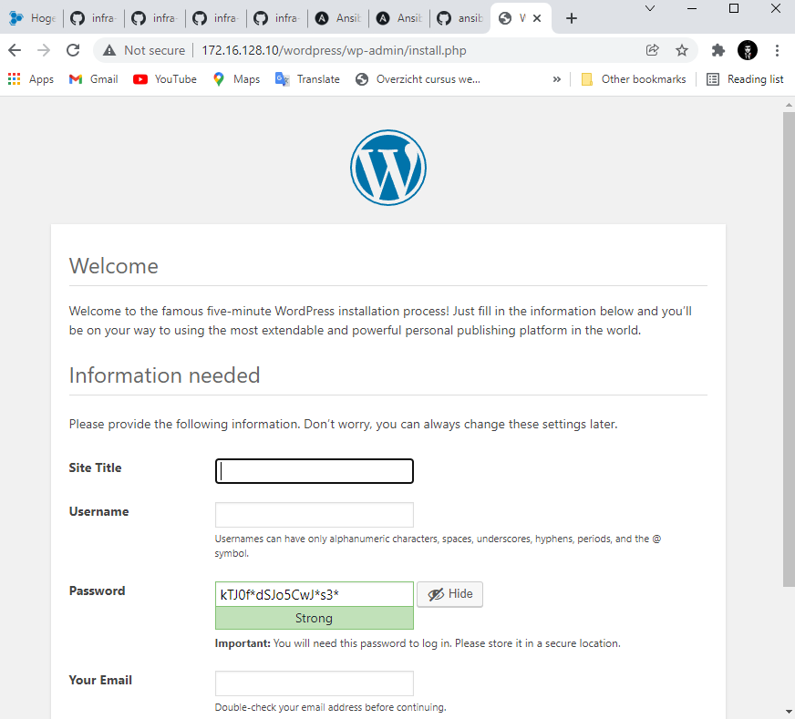

## 4. DNS
In this part we will create a new VM named `srv001` which will function as a DNS Server. This VM will use the Ansible role `bertvv.bind`. The purpose of the role is to set up an authoritative-only name server that only replies to queries within its own domain. 

### Preparation
1. Create a new host `srv001` in the `vagrant-hosts.yml` playbook.
```console
# vagrant-hosts.yml
---

- name: srv010
  ip: 172.16.128.10
  netmask: 255.255.0.0
  box: bento/almalinux-8

- name: srv001
  ip: 172.16.128.11
  netmask: 255.255.0.0
  box: bento/almalinux-8
```

2. Give the VM the role `bertvv.bind` in `/ansible/site.yml`.
```console
# site.yml
---
- hosts: all
  roles: 
    - bertvv.rh-base

- hosts: srv010
  roles:
    - bertvv.mariadb
    - bertvv.httpd
    - bertvv.wordpress

- hosts: srv001
  roles:
    - bertvv.bind
```

3. Run the script `scripts/role-deps.sh` to download the role.
```console
$ scripts/role-deps.sh

Cloning into 'ansible/roles/bertvv.bind'...
remote: Enumerating objects: 2064, done.
remote: Counting objects: 100% (81/81), done.
remote: Compressing objects: 100% (58/58), done.
remote: Total 2064 (delta 33), reused 48 (delta 15), pack-reused 1983
Receiving objects: 100% (2064/2064), 411.97 KiB | 2.16 MiB/s, done.
Resolving deltas: 100% (1212/1212), done.
+ Skipping bertvv.httpd, seems to be installed already
+ Skipping bertvv.mariadb, seems to be installed already
+ Skipping bertvv.rh-base, seems to be installed already
+ Skipping bertvv.wordpress, seems to be installed already
```

4. Create a playbook for this new VM in `/ansible/host_vars/srv001.yml`
```console
# host_vars/srv001.yml
---
```

### Caching name server 
Here we're going to configure the VM as a cachcing nameserver without any authorative zones. Define the necessary role variables in `ansible/host_vars/srv001.yml`.

- Allow any host to send a query to this DNS server
- Allow recursion.
- Set it up as a forward-only server.
- List IP addresses of 2 forwarders:

   - IP adress of the DNS-server provided in VirtualBox NAT network
   - Google's
- Disable DNSSEC


2. Brief overview of the `srv001.yml` playbook.
```console
# host_vars/srv001.yml
---
bind_allow_query:           # Allow any host to send a query to this DNS SERVER
  - any

bind_allow_recursion:       # Allow recursion
  - any
bind_recursion: true

bind_forward_only: true     # Set it up as a forward-only

bind_forwarders:            # List 2 forwarders
  - 10.0.2.3
  - 8.8.8.8

bind_dnssec_enable: false   # Disable DNSSEC
```

7. Start the VM with `vagrant up srv001` and SSH into it.

```console
$ vagrant up srv001

$ vagrant ssh srv001
```

8. Check the service state.

```console
[vagrant@srv001 ~]$ systemctl status named
● named.service - Berkeley Internet Name Domain (DNS)
   Loaded: loaded (/usr/lib/systemd/system/named.service; enabled; vendor preset: disabled)
   Active: active (running) since Tue 2021-12-21 12:42:09 UTC; 3h 8min ago
  Process: 14043 ExecReload=/bin/sh -c if /usr/sbin/rndc null > /dev/null 2>&1; then /usr/sbin/rndc reload; else /bin/kill -HUP $MAINPID; fi (code=exited, status=0/SUCCESS)
  Process: 7501 ExecStart=/usr/sbin/named -u named -c ${NAMEDCONF} $OPTIONS (code=exited, status=0/SUCCESS)
  Process: 7497 ExecStartPre=/bin/bash -c if [ ! "$DISABLE_ZONE_CHECKING" == "yes" ]; then /usr/sbin/named-checkconf -z "$NAMEDCONF"; else echo "Checking of zone files is disabled"; fi (>
 Main PID: 7502 (named)
    Tasks: 5 (limit: 4949)
   Memory: 98.6M
   CGroup: /system.slice/named.service
           └─7502 /usr/sbin/named -u named -c /etc/named.conf
```

9. Check the ports that are in use by the service.

```console
[vagrant@srv001 ~]$ sudo ss -tulnp | grep 'named'
udp   UNCONN 0      0          127.0.0.1:53        0.0.0.0:*    users:(("named",pid=7502,fd=512))
udp   UNCONN 0      0              [::1]:53           [::]:*    users:(("named",pid=7502,fd=513))
tcp   LISTEN 0      10         127.0.0.1:53        0.0.0.0:*    users:(("named",pid=7502,fd=21))
tcp   LISTEN 0      128        127.0.0.1:953       0.0.0.0:*    users:(("named",pid=7502,fd=23))
tcp   LISTEN 0      10             [::1]:53           [::]:*    users:(("named",pid=7502,fd=22))
tcp   LISTEN 0      128            [::1]:953          [::]:*    users:(("named",pid=7502,fd=24))
```

- Port 53 (DNS) is in use by the service.

10. Check the service logs with `sudo journalctl -f -u named`.

```console
[vagrant@srv001 ~]$ sudo journalctl -f -u named
-- Logs begin at Tue 2021-12-21 12:36:53 UTC. --
Dec 21 15:44:35 srv001 named[7502]: configuring command channel from '/etc/rndc.key'
Dec 21 15:44:35 srv001 named[7502]: configuring command channel from '/etc/rndc.key'
Dec 21 15:44:35 srv001 named[7502]: reloading configuration succeeded
Dec 21 15:44:35 srv001 named[7502]: reloading zones succeeded
Dec 21 15:44:35 srv001 sh[14043]: server reload successful
Dec 21 15:44:35 srv001 named[7502]: all zones loaded
Dec 21 15:44:35 srv001 named[7502]: running
Dec 21 15:44:35 srv001 named[7502]: connection refused resolving './DNSKEY/IN': 10.0.2.15#53
Dec 21 15:44:35 srv001 systemd[1]: Reloaded Berkeley Internet Name Domain (DNS).
Dec 21 15:44:35 srv001 named[7502]: managed-keys-zone: Key 20326 for zone . acceptance timer complete: key now trusted
```

11. Look at the contents of the main configuration file.

```console
[vagrant@srv001 ~]$ sudo cat /etc/named.conf
//
// named.conf
//
//
// Ansible managed
//
//
options {
  listen-on port 53 { 127.0.0.1; };
  listen-on-v6 port 53 { ::1; };
  directory   "/var/named";
  dump-file   "/var/named/data/cache_dump.db";
  statistics-file "/var/named/data/named_stats.txt";
  memstatistics-file "/var/named/data/named_mem_stats.txt";
  allow-query     { any; };

  recursion yes;
  allow-recursion { any; };
  forwarders { 10.0.2.15; 8.8.8.8; };  forward only;
  rrset-order { order random; };

  dnssec-validation True;

  /* Path to ISC DLV key */
  bindkeys-file "/etc/named.iscdlv.key";

  managed-keys-directory "/var/named/dynamic";

  pid-file "/run/named/named.pid";
  session-keyfile "/run/named/session.key";
};


logging {
  channel default_debug {
    file "data/named.run";
    severity dynamic;
    print-time yes;
  };
};

include "/etc/named.root.key";
include "/etc/named.rfc1912.zones";
```

12. Send a query to the DNS with `dig 172.16.128.2`.

```console
[vagrant@srv001 ~]$ dig 172.16.128.2

; <<>> DiG 9.11.26-RedHat-9.11.26-6.el8 <<>> 172.16.128.2
;; global options: +cmd
;; Got answer:
;; ->>HEADER<<- opcode: QUERY, status: NXDOMAIN, id: 10695
;; flags: qr rd ra ad; QUERY: 1, ANSWER: 0, AUTHORITY: 1, ADDITIONAL: 1

;; OPT PSEUDOSECTION:
; EDNS: version: 0, flags:; udp: 512
;; QUESTION SECTION:
;172.16.128.2.                  IN      A

;; AUTHORITY SECTION:
.                       86397   IN      SOA     a.root-servers.net. nstld.verisign-grs.com. 2021122100 1800 900 604800 86400

;; Query time: 21 msec
;; SERVER: 10.0.2.3#53(10.0.2.3)
;; WHEN: Tue Dec 21 17:03:00 UTC 2021
;; MSG SIZE  rcvd: 116
```

13. Send a query from your physical system to the DNS.
```console
$ nslookup hogent.be 172.16.128.2
Non-authoritative answer:
Server:  srv001.infra.lan
Address:  172.16.128.2

Name:    hogent.be
Address:  193.190.173.132
```

### Authorative name server

In this part we will add a zone file for our domain named `infra.lan`. 

1. Define the variable `bind_zones` in `/ansible/host_vars/srv001.yml` and specify:

- The domain name.
- The IP subnet(s) associated with this domain.
- The primary name server's IP address and name.
- Hosts within this domain, including their hostname, IP address and anly aliases.
  - Ensure that hosts can access the website on srv010 with either http://www.infra.lan/ or http://infra.lan/

```console
bind_allow_query:           # Allow any host to send a query to this DNS SERVER
  - any

bind_allow_recursion:       # Allow recursion
  - any
bind_recursion: true

bind_forward_only: true     # Set it up as a forward-only

bind_forwarders:            # List 2 forwarders
  - 10.0.2.3
  - 8.8.8.8

bind_dnssec_enable: false   # Disable DNSSEC

bind_listen_ipv4:
  - any

rhbase_firewall_allow_services:
  - dns
 
rhbase_firewall_allow_ports:
  - 80/tcp
  - 443/tcp

bind_zones:
  - name: infra.lan         # Domain name
    primaries:              # Primary name server's IP address
      - 172.16.128.2
    name_servers:
      - srv001              # Primary name server's IP Name
    hosts:                  # Hosts within this domain
      - name: physical      
        ip: 172.16.0.1
        aliases:
          - ps
      - name: srv001        # DNS Server
        ip: 172.16.128.2
        aliases:
          - ns
      - name: srv003        # DHCP Server
        ip: 172.16.128.3
        aliases:
          - dhcp
      - name: r001          # Router
        ip: 172.16.255.254
        aliases:
          - gw
      - name: '@'           # Enables "http://infra.lan/"
        ip: 172.16.128.10
        aliases:
          - www
    networks:               # IP subnets associated with this domain
      - '172.16.128'
```

2. Now appl the changes with `vagrant provision` and SSH to your VM.

```console
$ vagrant provision srv001
$ vagrant ssh srv001
```

3. Now check the main configuration file again. What has changed?

```console
[...]
zone "infra.lan" IN {
  type master;
  file "/var/named/infra.lan";
  notify yes;
  allow-update { none; };
};

zone "16.172.in-addr.arpa" IN {
  type master;
  file "/var/named/16.172.in-addr.arpa";
  notify yes;
  allow-update { none; };
};
```

- The output above has been added at the end of the configuration file.

4. Now query from your physical system to the DNS Server.

```console
$ nslookup infra.lan 172.16.128.2
Server:  srv001.infra.lan
Address:  172.16.128.2

Name:    infra.lan
Address:  172.16.128.10
```

## DHCP
In a local network, workstations usually get correct IP settings from a DHCP Server. In this part, we will create and configure a new VM named `srv003` as a DHCP server which will use the Ansible role `bertvv.dhcp`.

1. Create a new VM `srv003` within `vagrant-hosts.yml`.

```console
---

- name: srv010
  ip: 172.16.128.10
  netmask: 255.255.0.0
  box: bento/almalinux-8

- name: srv001
  ip: 172.16.128.2
  netmask: 255.255.0.0
  box: bento/almalinux-8

- name: srv003
  ip: 172.16.128.3
  netmask: 255.255.0.0
  box: bento/almalinux-8
```

2. Create a new empty playbook for the new VM at `host_vars/srv003.yml`.

```console
# host_vars/srv003.yml
---
```

3. Add the new host with the role `bertvv.dhcp` within `/ansible/site.yml`.

```console
# site.yml
---
- hosts: all
  roles: 
    - bertvv.rh-base

- hosts: srv010
  roles:
    - bertvv.mariadb
    - bertvv.httpd
    - bertvv.wordpress

- hosts: srv001
  roles:
    - bertvv.bind

- hosts: srv003
  roles:
    - bertvv.dhcp
```

4. Run the script `/scripts/role-deps.sh` to download the role.

```console
$ scripts/role-deps.sh
+ Skipping bertvv.bind, seems to be installed already
Cloning into 'ansible/roles/bertvv.dhcp'...
remote: Enumerating objects: 740, done.
remote: Counting objects: 100% (47/47), done.
remote: Compressing objects: 100% (35/35), done.
remote: Total 740 (delta 15), reused 30 (delta 8), pack-reused 693
Receiving objects: 100% (740/740), 150.21 KiB | 2.73 MiB/s, done.
Resolving deltas: 100% (364/364), done.
+ Skipping bertvv.httpd, seems to be installed already
+ Skipping bertvv.mariadb, seems to be installed already
+ Skipping bertvv.rh-base, seems to be installed already
+ Skipping bertvv.wordpress, seems to be installed already
```

5. Configure the DHCP server so workstations that attach to the network get an IP address in the correct range and all other necessary settings to get acces to the LAN and the Internet. Lease time is 4 hours.

Some remarks:
- Only hosts with a dynamic or reserved IP address are assigned by the DHCP server.
- Make sure that there's no overlap between, the address range in the subnet declaration.
- A subnet declaration's network IP should match the DHCP server's IP address, otherwise the daemon will not start.

```console
# host_vars/srv003.yml
---
dhcp_global_domain_name: infra.lan 
dhcp_global_domain_name_servers:     #DNS Server IP
  - 172.16.128.2
dhcp_global_routers: 172.16.255.254  
dhcp_global_bootp: allow
dhcp_global_booting: allow

dhcp_subnets:
  - ip: 172.16.0.0                   # IP Range
    netmask: 255.255.0.0             # Subnet
    range_begin: 172.16.0.2          # Start Range
    range_end: 172.16.127.254        # End Range
    pools:                          
      - default_lease_time: 14400
        max_lease_time: 14400
        range_begin: 172.16.192.1
        range_end: 172.16.255.253
```

6. Run the command `vagrant up srv003` to create the VM with the configurations.
```console
$ vagrant up srv003
```

## Router
In the previous parts of this lab assignment, we set up several machines that, when put together, can form a fully functioning local network. There's still a component missing, and that is the router that connects this network with the outside world. So, next, we are going to set up a router and configure it using Ansible.

There are some Vagrant base boxes for router OSs, but most don't work very well. So, for the purpose of this lab assignment, we will have to configure the VM manually. We'll be using a Cisco IOS VM (CSR1000v). If you are enrolled in a Cisco NetAcad academy, you should have access to the following files:

VirtualBox ETW-CSR1000v.ova: base VirtualBox appliance
csr1000v-universalk9.17.03.02.iso (or a newer version), the installation ISO for Cisco IOS
Be aware that the router VM takes 4GB of RAM!

### Create and boot the router VM
1. Import the OVA file in VirtualBox and put it in the `vmlab` group.

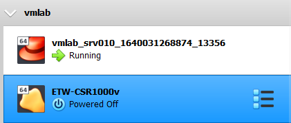

2. Copy and paste the .iso file to the directory that contains the VM `C:\Users\Ismail\VirtualBox VMs\vmlab\ETW-CSR1000v`.

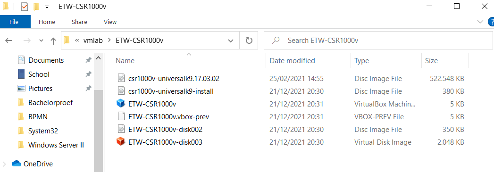

3. Edit the Network setings of the VM:

   - Adapter 1: NAT
     - Set Adapter Type: Paravirtualized Network (virtio-net)

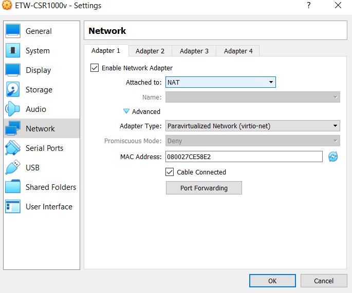

   - Adapter 2: Host only
    - Set Adapter Type: Paravirtualized Network (virtio-net)

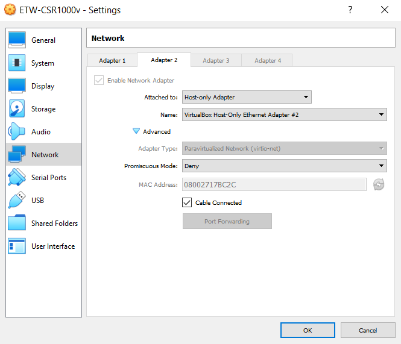

1. Insert the ISO image we that we've pasted in the directory.


5. Boot the VM and wait until you get the following text. This may take a while.

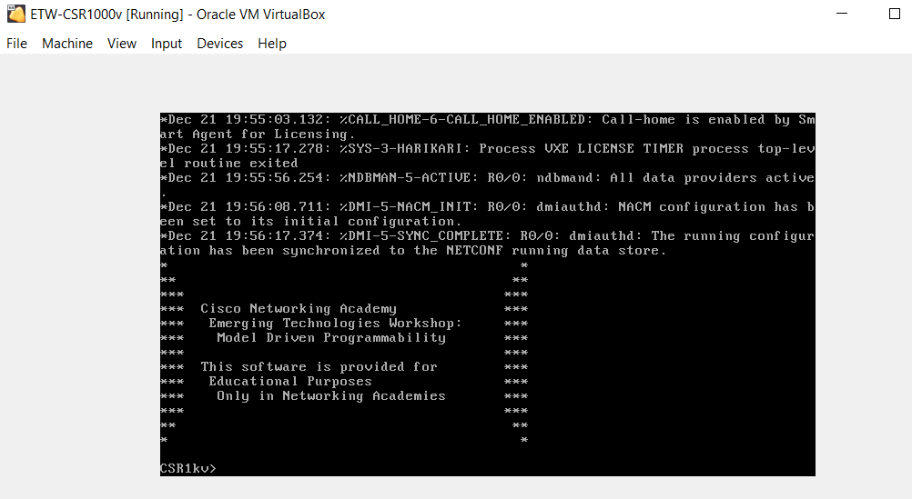

### Check the default configuration

1. On VirtualBox press settings for the VM and go to Network Adapter NAT. Click on port forwarding. Verify which port to use to SSH into the machine. Here it is port `5022`.
  
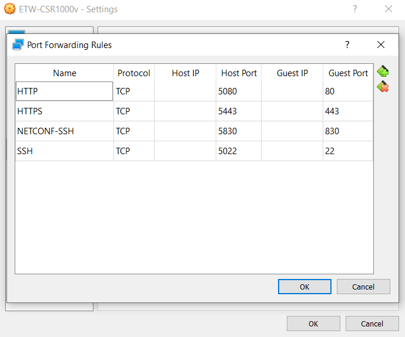

2. SSH into the Router VM from your Git Bash terminal. The password is `cisco123!`.

```console
$ ssh -o StrictHostKeyChecking=no -p 5022 cisco@127.0.0.1
Warning: Permanently added '[127.0.0.1]:5022' (RSA) to the list of known hosts.
(cisco@127.0.0.1) Password: cisco123!

*                                           *
**                                         **
***                                       ***
***  Cisco Networking Academy             ***
***   Emerging Technologies Workshop:     ***
***    Model Driven Programmability       ***
***                                       ***
***  This software is provided for        ***
***   Educational Purposes                ***
***    Only in Networking Academies       ***
***                                       ***
**                                         **
*                                           *


CSR1kv#
```

3. Show the network interfaces.

```console
CSR1kv#show ip int brief
Interface              IP-Address      OK? Method Status                Protocol
GigabitEthernet1       10.0.2.15       YES DHCP   up                    up
```

- GigebitEthernet2 is not listed yet. We will add this shortly.

4. Show the routing table.

```console
CSR1kv#show ip route
Codes: L - local, C - connected, S - static, R - RIP, M - mobile, B - BGP
       D - EIGRP, EX - EIGRP external, O - OSPF, IA - OSPF inter area
       N1 - OSPF NSSA external type 1, N2 - OSPF NSSA external type 2
       E1 - OSPF external type 1, E2 - OSPF external type 2, m - OMP
       n - NAT, Ni - NAT inside, No - NAT outside, Nd - NAT DIA
       i - IS-IS, su - IS-IS summary, L1 - IS-IS level-1, L2 - IS-IS level-2
       ia - IS-IS inter area, * - candidate default, U - per-user static route
       H - NHRP, G - NHRP registered, g - NHRP registration summary
       o - ODR, P - periodic downloaded static route, l - LISP
       a - application route
       + - replicated route, % - next hop override, p - overrides from PfR
       & - replicated local route overrides by connected

Gateway of last resort is 10.0.2.2 to network 0.0.0.0

S*    0.0.0.0/0 [254/0] via 10.0.2.2
      10.0.0.0/8 is variably subnetted, 2 subnets, 2 masks
C        10.0.2.0/24 is directly connected, GigabitEthernet1
L        10.0.2.15/32 is directly connected, GigabitEthernet1
```

### Managing the router with Ansible

1. Create a new playbook named `inventory.yml` in `/ansible/inventory.yml` and insert the following code:
```console
# Inventory file for accessing a Cisco CSR1000v VirtualBox VM
---
all:
  hosts:
    CSR1kv:
      ansible_connection: "ansible.netcommon.network_cli"
      ansible_network_os: "ios"
      ansible_host: "127.0.0.1"
      ansible_port: 5022
      ansible_user: "cisco"
      ansible_password: "cisco123!"
```

2. On VirtualBox go to File > Host Network Manager. Change the IP address of Ethernet Adapter #2 to `172.16.255.254/16`.


3. Now bring some changes to `inventory.yml`. We will set:
   - ansible_connection: "network_cli"
   - ansible_host: 172.16.255.254

```console
# Inventory file for accessing a Cisco CSR1000v VirtualBox VM
---
all:
  hosts:
    CSR1kv:
      ansible_connection: "network_cli"
      ansible_network_os: "ios"
      ansible_host: "172.16.255.254"
      ansible_port: 5022
      ansible_user: "cisco"
      ansible_password: "cisco123!"
```

4. Now SSH to the VM `srv003` and navigate to `/vagrant/ansible`.

```console
$ vagrant ssh srv003

This system is built by the Bento project by Chef Software
More information can be found at https://github.com/chef/bento
Last login: Tue Dec 21 21:20:11 2021 from 10.0.2.2

[vagrant@srv003 ~]$ cd /vagrant/ansible
```

5. First, let's verify we can SSH into the Router VM. When done exit the Router VM.

```console
[vagrant@srv003 ~]$ ssh -p 5022 cisco@172.16.255.254
Password:

*                                           *
**                                         **
***                                       ***
***  Cisco Networking Academy             ***
***   Emerging Technologies Workshop:     ***
***    Model Driven Programmability       ***
***                                       ***
***  This software is provided for        ***
***   Educational Purposes                ***
***    Only in Networking Academies       ***
***                                       ***
**                                         **
*                                           *


CSR1kv#exit
```

- We can SSH succesfully into the router. Exit the router.

6. Now navigate to `/vagrant/ansible/` and run the command `[vagrant@srv003 ansible]$ ansible -i inventory.yml -m ios_facts -a "gather_subset=all" all`.

```console
[vagrant@srv003 ~]$ cd /vagrant/ansible/

[vagrant@srv003 ansible]$ ansible -i inventory.yml -m ios_facts -a "gather_subset=all" all
[WARNING]: default value for `gather_subset` will be changed to `min` from `!config` v2.11 onwards
[WARNING]: Platform linux on host CSR1kv is using the discovered Python interpreter at /usr/bin/python3.6, but future installation
of another Python interpreter could change this. See
https://docs.ansible.com/ansible/2.9/reference_appendices/interpreter_discovery.html for more information.
CSR1kv | SUCCESS => {
    "ansible_facts": {
        "ansible_net_all_ipv4_addresses": [
            "10.0.2.15"
        ],
        "ansible_net_all_ipv6_addresses": [],
        "ansible_net_api": "cliconf",
        "ansible_net_config": "!\n! Last configuration change at 20:34:01 UTC Tue Dec 21 2021 by cisco\n!\nversion 17.3\nservice timestamps debug datetime msec\nservice timestamps log datetime msec\n! Call-home is enabled by Smart-Licensing.\nservice call-home\nplatform qfp utilization monitor load 80\nplatform punt-keepalive disable-kernel-core\nplatform console virtual\n!\nhostname CSR1kv\n!\nboot-start-marker\nboot-end-marker\n!\n!\n!\nno aaa new-model\n!\n!\n!\n!\n!\n!\n!\n!\n!\n!\nlogin on-success log\n!\n!\n!\n!\n!\n!\n!\nsubscriber templating\n! \n! \n! \n! \n!\n!\nmultilink bundle-name authenticated\n!\n!\n!\n!\n!\n!\n!\n!\n!\n!\n!\n!\n!\n!\n!\ncrypto pki trustpoint TP-self-signed-2510254992\n enrollment selfsigned\n subject-name cn=IOS-Self-Signed-Certificate-2510254992\n revocation-check none\n rsakeypair TP-self-signed-2510254992\n!\ncrypto pki trustpoint SLA-TrustPoint\n enrollment pkcs12\n revocation-check crl\n!\n!\ncrypto pki certificate chain TP-self-signed-2510254992\n certificate self-signed 01\n  30820330 30820218 A0030201 02020101 300D0609 2A864886 F70D0101 
[...]
        494E8A9E 07B85737 F3A58BE1 1A48A229 C37C1E69 39F08678 \n  80DDCD16 D6BACECA EEBC7CF9 8428787B 35202CDC 60E4616A B623CDBD 230E3AFB \n  418616A9 4093E049 4D10AB75 27E86F73 932E35B5 8862FDAE 0275156F 719BB2F0 \n  D697DF7F 28\n  \tquit\n!\nlicense udi pid CSR1000V sn 9QE13VJJW6N\ndiagnostic bootup level minimal\nmemory free low-watermark processor 71507\n!\n!\nspanning-tree extend system-id\n!\nusername cisco privilege 15 password 0 cisco123!\n!\nredundancy\n!\n!\n!\n!\n!\n!\n!\n! \n!\n!\n!\n!\n!\n!\n!\n!\n!\n!\n!\n!\n!\n! \n! \n!\n!\ninterface GigabitEthernet1\n description VBox\n ip address dhcp\n negotiation auto\n no mop enabled\n no mop sysid\n!\nip forward-protocol nd\nno ip http server\nip http authentication local\nip http secure-server\n!\n!\n!\n!\n!\n!\n!\n!\ncontrol-plane\n!\n!\n!\n!\n!\nbanner motd ^C\n*                                           *\n**                                         **\n***                                       ***\n***  Cisco Networking Academy             ***\n***   Emerging Technologies Workshop:     ***\n***    Model Driven Programmability       ***\n***                                       ***\n***  This software is provided for        ***\n***   Educational Purposes                ***\n***    Only in Networking Academies       ***\n***                                       ***\n**                                         **\n*                                           *\n^C\n!\nline con 0\n logging synchronous\n stopbits 1\nline vty 0 4\n login local\n transport input ssh\nline vty 5 15\n login local\n transport input ssh\n!\ncall-home\n ! If contact email address in call-home is configured as sch-smart-licensing@cisco.com\n ! the email address configured in Cisco Smart License Portal will be used as contact email address to send SCH notifications.\n contact-email-addr sch-smart-licensing@cisco.com\n profile \"CiscoTAC-1\"\n  active\n  destination transport-method http\n!\n!\n!\n!\n!\nnetconf-yang\nrestconf\nend",
        "ansible_net_filesystems": [
            "bootflash:"
        ],
        "ansible_net_filesystems_info": {
            "bootflash:": {
                "spacefree_kb": 5308504.0,
                "spacetotal_kb": 6139200.0
            }
        },
        "ansible_net_gather_network_resources": [],
        "ansible_net_gather_subset": [
            "hardware",
            "config",
            "interfaces",
            "default"
        ],
        "ansible_net_hostname": "CSR1kv",
        "ansible_net_image": "bootflash:packages.conf",
        "ansible_net_interfaces": {
            "GigabitEthernet1": {
                "bandwidth": 1000000,
                "description": "VBox",
                "duplex": "Full",
                "ipv4": [
                    {
                        "address": "10.0.2.15",
                        "subnet": "24"
                    }
                ],
                "lineprotocol": "up",
                "macaddress": "0800.27ce.58e2",
                "mediatype": "Virtual",
                "mtu": 1500,
                "operstatus": "up",
                "type": "CSR vNIC"
            }
        },
        "ansible_net_iostype": "IOS-XE",
        "ansible_net_memfree_mb": 1824618.29296875,
        "ansible_net_memtotal_mb": 2071871.80859375,
        "ansible_net_model": "CSR1000V",
        "ansible_net_neighbors": {},
        "ansible_net_python_version": "3.6.8",
        "ansible_net_serialnum": "9QE13VJJW6N",
        "ansible_net_system": "ios",
        "ansible_net_version": "17.03.02",
        "ansible_network_resources": {},
        "discovered_interpreter_python": "/usr/bin/python3.6"
    },
    "changed": false
}
```

- Success!

### Writing the playbook

Now we will create the playbook to actually configure our router.

1. Create the playbook `router-config.yml` in `vmlab/ansible`. (same directory as `site.yml` playbook) with the next components.

- Replace IP_ADDRESS with the actual IP address of the router in CIDR notation: `172.16.255.254/16`

```console
# Router configuration playbook
---
- hosts: CSR1kv
  tasks:
    - name: Set interface GE2
      cisco.ios.ios_l3_interfaces:
        config:
          - name: GigabitEthernet2
            ipv4:
              - address: 172.16.255.254/16
        state: merged
    - name: Enable GE2
      cisco.ios.ios_interfaces:
        config:
          - name: GigabitEthernet2
            enabled: yes
        state: merged
    - name: Change hostname
      cisco.ios.ios_system:
        hostname: r001
```

2. On `srv003` navigate to `vagrant/ansible` and execute the command `ansible-playbook -i inventory.yml router-config.yml`

```console
[vagrant@srv003 ansible]$ ansible-playbook -i inventory.yml router-config.yml

PLAY [CSR1kv] ****************************************************************************************************************************************

TASK [Gathering Facts] *******************************************************************************************************************************
[WARNING]: Ignoring timeout(10) for ios_facts
[WARNING]: default value for `gather_subset` will be changed to `min` from `!config` v2.11 onwards
[WARNING]: Platform linux on host CSR1kv is using the discovered Python interpreter at /usr/bin/python3.6, but future installation of another Python
interpreter could change this. See https://docs.ansible.com/ansible/2.9/reference_appendices/interpreter_discovery.html for more information.
ok: [CSR1kv]

TASK [Set interface GE2] *****************************************************************************************************************************
changed: [CSR1kv]

TASK [Enable GE2] ************************************************************************************************************************************
changed: [CSR1kv]

TASK [Change hostname] ************************************************************************************************************************************
changed: [CSR1kv]

PLAY RECAP *******************************************************************************************************************************************
CSR1kv                     : ok=3    changed=2    unreachable=0    failed=0    skipped=0    rescued=0    ignored=0
```

3. Control the IP address on the router with `show ip int br`

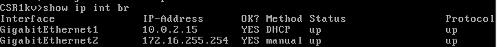

- Success!

### Integration a working LAN

1. Download the Kali Linux ova file (Virtualbox 64-bit) and import it in Virtualbox. This machine will serve as a workstation. 

https://www.kali.org/get-kali/#kali-virtual-machines


2. Set the network adapter to:

   - Adapter 1
     - Host-Only
     - Same Ethernet Adapter #2 which the router uses!

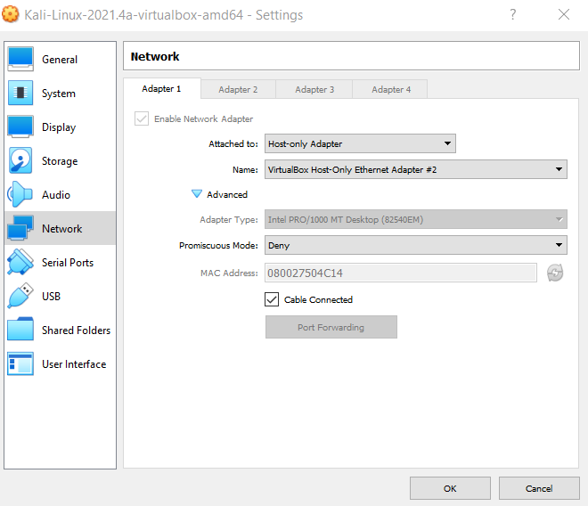

3. Start the VM and show the `ip address`, `default gateway` and `dns server`.

```console
                                                                             
┌──(kali㉿kali)-[~]
└─$ ip a
1: lo: <LOOPBACK,UP,LOWER_UP> mtu 65536 qdisc noqueue state UNKNOWN group default qlen 1000
    link/loopback 00:00:00:00:00:00 brd 00:00:00:00:00:00
    inet 127.0.0.1/8 scope host lo
       valid_lft forever preferred_lft forever
    inet6 ::1/128 scope host 
       valid_lft forever preferred_lft forever
2: eth0: <BROADCAST,MULTICAST,UP,LOWER_UP> mtu 1500 qdisc pfifo_fast state UP group default qlen 1000
    link/ether 08:00:27:50:4c:14 brd ff:ff:ff:ff:ff:ff
    inet 172.16.0.3/16 brd 172.16.255.255 scope global dynamic noprefixroute eth0
       valid_lft 40041sec preferred_lft 40041sec
    inet6 fe80::a00:27ff:fe50:4c14/64 scope link noprefixroute 
       valid_lft forever preferred_lft forever
                                                                             
┌──(kali㉿kali)-[~]
└─$ ip r
default via 172.16.255.254 dev eth0 proto dhcp metric 100 
172.16.0.0/16 dev eth0 proto kernel scope link src 172.16.0.3 metric 100 
                                                                             
┌──(kali㉿kali)-[~]
└─$ cat /etc/resolv.conf
# Generated by NetworkManager
search infra.lan
nameserver 172.16.128.2
```

- IP address: 172.16.0.3/16
  - Correct. 
- Default gateway: 172.16.255.254
  - Correct
- DNS server: 172.16.128.2
  - Correct

4. Ping all the machines in the environment with their alias:
   - ns
   - dhcp
   - gw
   - www 

```console
┌──(kali㉿kali)-[~]
└─$ ping ns            
PING srv001.infra.lan (172.16.128.2) 56(84) bytes of data.
64 bytes from srv001.infra.lan (172.16.128.2): icmp_seq=1 ttl=64 time=0.463 ms
64 bytes from srv001.infra.lan (172.16.128.2): icmp_seq=2 ttl=64 time=0.507 ms
^C
--- srv001.infra.lan ping statistics ---
2 packets transmitted, 2 received, 0% packet loss, time 1001ms
rtt min/avg/max/mdev = 0.463/0.485/0.507/0.022 ms
                                                                             
┌──(kali㉿kali)-[~]
└─$ ping dhcp
PING srv003.infra.lan (172.16.128.3) 56(84) bytes of data.
64 bytes from srv003.infra.lan (172.16.128.3): icmp_seq=1 ttl=64 time=0.865 ms
64 bytes from srv003.infra.lan (172.16.128.3): icmp_seq=2 ttl=64 time=0.470 ms
^C
--- srv003.infra.lan ping statistics ---
2 packets transmitted, 2 received, 0% packet loss, time 1002ms
rtt min/avg/max/mdev = 0.470/0.667/0.865/0.197 ms
                                                                             
┌──(kali㉿kali)-[~]
└─$ ping gw  
PING r001.infra.lan (172.16.255.254) 56(84) bytes of data.
64 bytes from 172.16.255.254 (172.16.255.254): icmp_seq=1 ttl=255 time=0.435 ms
64 bytes from 172.16.255.254 (172.16.255.254): icmp_seq=2 ttl=255 time=0.425 ms
^C
--- r001.infra.lan ping statistics ---
2 packets transmitted, 2 received, 0% packet loss, time 1001ms
rtt min/avg/max/mdev = 0.425/0.430/0.435/0.005 ms
                                                                             
┌──(kali㉿kali)-[~]
└─$ ping www
PING infra.lan (172.16.128.10) 56(84) bytes of data.
64 bytes from infra.lan (172.16.128.10): icmp_seq=1 ttl=64 time=0.455 ms
64 bytes from infra.lan (172.16.128.10): icmp_seq=2 ttl=64 time=0.479 ms
^C
--- infra.lan ping statistics ---
2 packets transmitted, 2 received, 0% packet loss, time 1001ms
rtt min/avg/max/mdev = 0.455/0.467/0.479/0.012 ms
```

5. Check whether you have access to the internet and internal website `www.infra.lan/wordpress`.

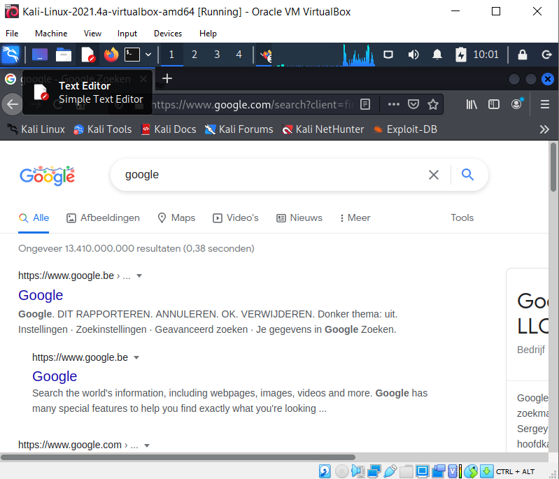

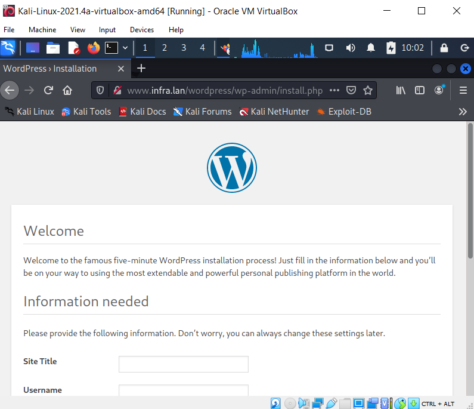


## Resources

List all sources of useful information that you encountered while completing this assignment: books, manuals, HOWTO's, blog posts, etc.

```console

```
