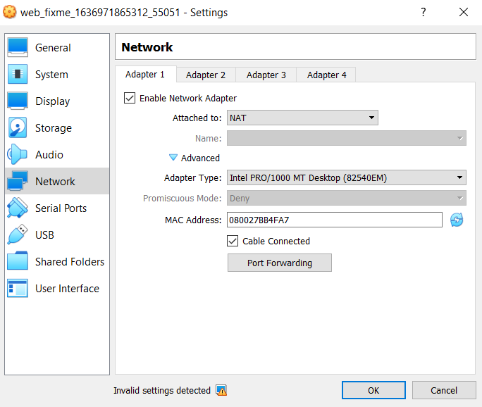
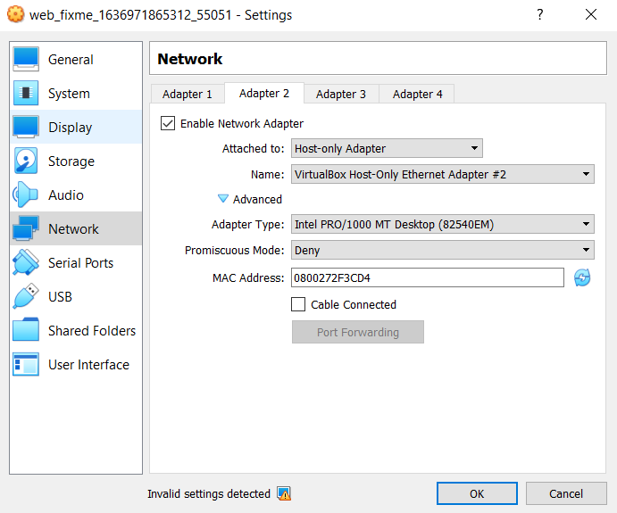
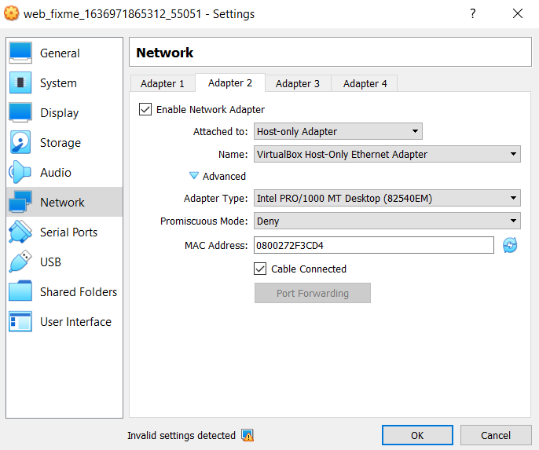
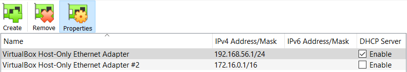
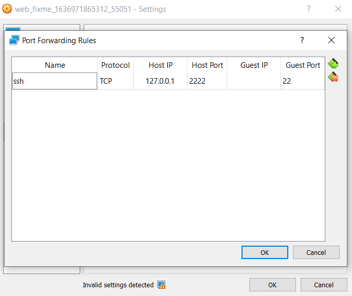
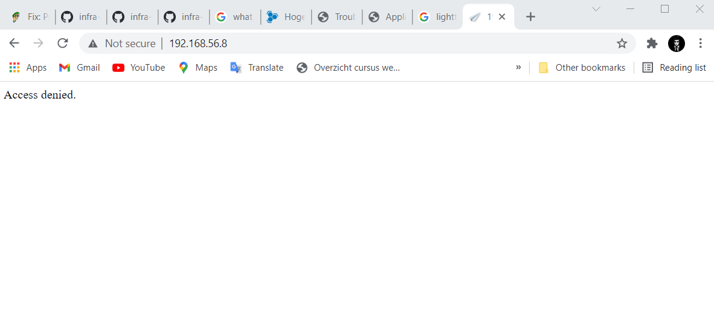
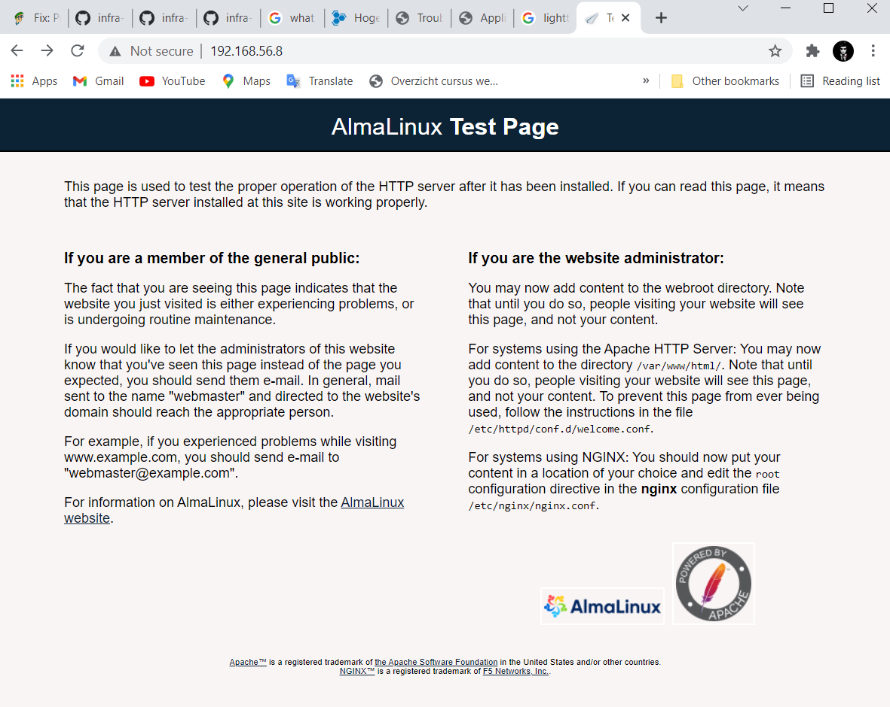
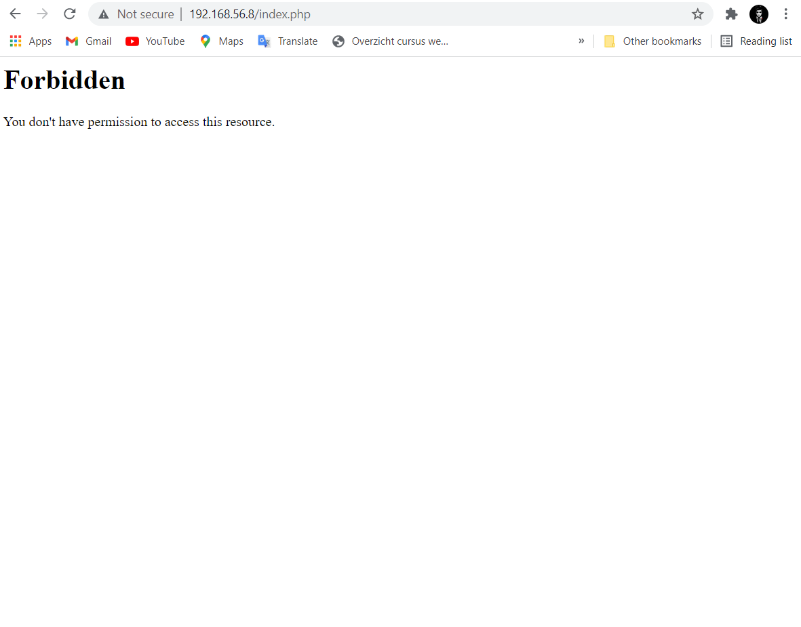

# Enterprise Linux Laboverslag - Troubleshooting

- Student: Ismail Karakaya
- Klasgroep: TIN-TI/G3.B

## Verslag

### Fase 1: Physical Layer

1. We bekijken Adapter 1: NAT van onze machine.



- Onze adapter staat aan en cable is connected.

1. We bekijken Adapter 2: Host-only van onze machine.



- We zien dat het een verkeerde network adapter gebruikt en de cable is niet connected.

1. We veranderen `VirtualBox Host-only Ethernet Adapter #2` naar `VirtualBox Host-only Ethernet Adapter` om in correcte subnet te zitten we vinken `Cable Connected` aan.





1. We drukken op `Port Forwarding` op Tabblad `Adapter 1` NAT.



- We gebruiken deze credentials om via Git Bash the SSHen naar onze virtuele machine.

1. Start virtuele machine op via Vbox en ssh naar de machine via een CLI adhv gegeven `Host Port` en `Host IP` van vorige screenshot.

```console
$ ssh -p 2222 vagrant@127.0.0.1
vagrant@127.0.0.1's password:

This system is built by the Bento project by Chef Software
More information can be found at https://github.com/chef/bento
Last login: Mon Nov 22 11:41:55 2021 from 10.0.2.2
[vagrant@fixme ~]$
```

- We zitten in de VM.


### Fase 2: Network Access Layer

1. We controleren of dat onze interfaces signaal ontvangen met commando `ip link`.

```console
[vagrant@fixme ~]$ ip link
1: lo: <LOOPBACK,UP,LOWER_UP> mtu 65536 qdisc noqueue state UNKNOWN mode DEFAULT group default qlen 1000
    link/loopback 00:00:00:00:00:00 brd 00:00:00:00:00:00
2: eth0: <BROADCAST,MULTICAST,UP,LOWER_UP> mtu 1500 qdisc fq_codel state UP mode DEFAULT group default qlen 1000
    link/ether 08:00:27:bb:4f:a7 brd ff:ff:ff:ff:ff:ff
3: eth1: <BROADCAST,MULTICAST,UP,LOWER_UP> mtu 1500 qdisc fq_codel state UP mode DEFAULT group default qlen 1000
    link/ether 08:00:27:2f:3c:d4 brd ff:ff:ff:ff:ff:ff
```

Onze beide interfaces ontvangen een signaal dit kunnen we zien door **BROADCAST**.


### Fase 3: Internet Layer

1. We controleren of dat we de correcte IP addressen hebben op onze interfaces met commando `ip address`.

```console
[vagrant@fixme ~]$ ip a
1: lo: <LOOPBACK,UP,LOWER_UP> mtu 65536 qdisc noqueue state UNKNOWN group default qlen 1000
    link/loopback 00:00:00:00:00:00 brd 00:00:00:00:00:00
    inet 127.0.0.1/8 scope host lo
       valid_lft forever preferred_lft forever
    inet6 ::1/128 scope host
       valid_lft forever preferred_lft forever
2: eth0: <BROADCAST,MULTICAST,UP,LOWER_UP> mtu 1500 qdisc fq_codel state UP group default qlen 1000
    link/ether 08:00:27:bb:4f:a7 brd ff:ff:ff:ff:ff:ff
    inet 10.0.2.15/24 brd 10.0.2.255 scope global dynamic noprefixroute eth0
       valid_lft 85291sec preferred_lft 85291sec
    inet6 fe80::4f1b:2c6f:77d9:7d8f/64 scope link noprefixroute
       valid_lft forever preferred_lft forever
3: eth1: <BROADCAST,MULTICAST,UP,LOWER_UP> mtu 1500 qdisc fq_codel state UP group default qlen 1000
    link/ether 08:00:27:2f:3c:d4 brd ff:ff:ff:ff:ff:ff
    inet 192.168.56.8/24 brd 192.168.56.255 scope global noprefixroute eth1
       valid_lft forever preferred_lft forever
    inet6 fe80::a00:27ff:fe2f:3cd4/64 scope link
       valid_lft forever preferred_lft forever
```

Onze eth0 en eth1 adapters zijn correct ingesteld met IPv4 en IPv6 adressen. We hebben ook een loopback interface. 


2. We controleren de configfiles `(ifcfg-eth0 & ifcfg-eth1)` van onze interfaces binnen `/etc/sysconfig/network-scripts/` voor zekerheid.

- eth0
```console
[vagrant@fixme network-scripts]$ cat ifcfg-eth0
TYPE=Ethernet
PROXY_METHOD=none
BROWSER_ONLY=no
BOOTPROTO=dhcp
DEFROUTE=yes
IPV4_FAILURE_FATAL=no
IPV6INIT=yes
IPV6_AUTOCONF=yes
IPV6_DEFROUTE=yes
IPV6_FAILURE_FATAL=no
IPV6_ADDR_GEN_MODE=stable-privacy
NAME=eth0
DEVICE=eth0
ONBOOT=yes
```
- eth0 ontvangt een IP via DHCP.
- DEVICE=eth0 (Correct)
- ONBOOT=yes (Correct)
- BOOTPROTO=dhcp (Correct)

- eth1

```console
[vagrant@fixme network-scripts]$ cat ifcfg-eth1
NM_CONTROLLED=yes
BOOTPROTO=none
ONBOOT=yes
IPADDR=192.168.56.8
NETMASK=255.255.255.0
DEVICE=eth1
PEERDNS=no
#VAGRANT-END
TYPE=Ethernet
PROXY_METHOD=none
BROWSER_ONLY=no
PREFIX=24
DEFROUTE=yes
IPV4_FAILURE_FATAL=no
RES_OPTIONS=single-request-reopen
IPV6INIT=no
NAME="System eth1"
UUID=9c92fad9-6ecb-3e6c-eb4d-8a47c6f50c04
```

- eth1 is statisch configureerd.
- DEVICE=eth1 (Correct)
- ONBOOT=yes (Correct)
- BOOTPROTO=none (Correct)
- IPADDR=192.168.56.8 (Correct)
- NETMASK=255.255.255.0 (Correct)


3. We restarten de network service voor zekerheid om eventuele fouten die we over het hoofd zien te vermijden.
```console
[vagrant@fixme network-scripts]]$ sudo systemctl restart network
```

4. We gebruiken commando `ip route` om de routing table te tonen om onze default gateway te checken.

```console
[vagrant@fixme network-scripts]$ ip route
default via 10.0.2.2 dev eth0 proto dhcp metric 100
10.0.2.0/24 dev eth0 proto kernel scope link src 10.0.2.15 metric 100
192.168.56.0/24 dev eth1 proto kernel scope link src 192.168.56.8 metric 101
```

- We zien dat we een default gateway (**10.0.2.2**) hebben en onze beide interfaces zitten ook in de correcte subnet. 

4. We checken de file `/etc/resolv.conf` om te zien of dat onze machine een DNS server heeft die hij het kan contacteren.
```console
[vagrant@fixme network-scripts]$ cat /etc/resolv.conf
# Generated by NetworkManager
search hogent.be
nameserver 10.0.2.3
options single-request-reopen
```

- We hebben een DNS server van 10.0.2.3 waarmee ons apparaat 'contact' kan opnemen.

5. We proberen de DNS server te queryen met commando `getent ahosts icanhazip.com` om te zien of we effectiec contact kunnen leggen met de DNS.
```console
[vagrant@fixme network-scripts]$ getent ahosts icanhazip.com
104.18.114.97   STREAM icanhazip.com
104.18.114.97   DGRAM
104.18.114.97   RAW
104.18.115.97   STREAM
104.18.115.97   DGRAM
104.18.115.97   RAW
2606:4700::6812:7261 STREAM
2606:4700::6812:7261 DGRAM
2606:4700::6812:7261 RAW
2606:4700::6812:7361 STREAM
2606:4700::6812:7361 DGRAM
2606:4700::6812:7361 RAW
```

- We kunnen succesvol contact opleggen met onze DNS server.

1. We gaan pingen tussen hosts, default gateway en DNS om te zien of dat we ze met elkaar kunnen laten communiceren. 

- Host -> VM
```console
C:\Users\Ismail>ping 192.168.56.8

Pinging 192.168.56.8 with 32 bytes of data:
Reply from 192.168.56.8: bytes=32 time<1ms TTL=64
Reply from 192.168.56.8: bytes=32 time<1ms TTL=64
Reply from 192.168.56.8: bytes=32 time<1ms TTL=64
Reply from 192.168.56.8: bytes=32 time<1ms TTL=64

Ping statistics for 192.168.56.8:
    Packets: Sent = 4, Received = 4, Lost = 0 (0% loss),
Approximate round trip times in milli-seconds:
    Minimum = 0ms, Maximum = 0ms, Average = 0ms
```

Onze host kan de VM contacteren na het uitzetten van Windows defender firewall.

- VM -> Host

```console
[vagrant@fixme bin]$ ping 192.168.56.1
PING 192.168.56.1 (192.168.56.1) 56(84) bytes of data.
64 bytes from 192.168.56.1: icmp_seq=1 ttl=128 time=0.241 ms
64 bytes from 192.168.56.1: icmp_seq=2 ttl=128 time=0.341 ms
64 bytes from 192.168.56.1: icmp_seq=3 ttl=128 time=0.302 ms
64 bytes from 192.168.56.1: icmp_seq=4 ttl=128 time=0.318 ms
^C
--- 192.168.56.1 ping statistics ---
4 packets transmitted, 4 received, 0% packet loss, time 3088ms
rtt min/avg/max/mdev = 0.241/0.300/0.341/0.040 ms
```

Ook onze VM kan de host contacteren. 

- VM -> Default Gateway

```console
[vagrant@fixme bin]$ ping 10.0.2.2
PING 10.0.2.2 (10.0.2.2) 56(84) bytes of data.
64 bytes from 10.0.2.2: icmp_seq=1 ttl=64 time=0.276 ms
64 bytes from 10.0.2.2: icmp_seq=2 ttl=64 time=0.257 ms
64 bytes from 10.0.2.2: icmp_seq=3 ttl=64 time=0.271 ms
64 bytes from 10.0.2.2: icmp_seq=4 ttl=64 time=0.264 ms
64 bytes from 10.0.2.2: icmp_seq=5 ttl=64 time=0.276 ms
^C
--- 10.0.2.2 ping statistics ---
5 packets transmitted, 5 received, 0% packet loss, time 4121ms
rtt min/avg/max/mdev = 0.257/0.268/0.276/0.022 ms
```
    
Onze VM kan de default gateway contacteren.

- VM -> DNS

```console
[vagrant@fixme html]$ ping 10.0.2.3
PING 10.0.2.3 (10.0.2.3) 56(84) bytes of data.
64 bytes from 10.0.2.3: icmp_seq=1 ttl=64 time=0.261 ms
64 bytes from 10.0.2.3: icmp_seq=2 ttl=64 time=0.172 ms
64 bytes from 10.0.2.3: icmp_seq=3 ttl=64 time=0.163 ms
64 bytes from 10.0.2.3: icmp_seq=4 ttl=64 time=0.287 ms
64 bytes from 10.0.2.3: icmp_seq=5 ttl=64 time=0.275 ms
^C
--- 10.0.2.3 ping statistics ---
5 packets transmitted, 5 received, 0% packet loss, time 4107ms
rtt min/avg/max/mdev = 0.163/0.231/0.287/0.055 ms
```

Onze VM kan de DNS server contacteren.

## Fase 4: Transport Layer

1. We controleren of dat de `httpd` service enabled is.
```console
[vagrant@fixme html]$ systemctl status httpd
● httpd.service - The Apache HTTP Server
   Loaded: loaded (/usr/lib/systemd/system/httpd.service; disabled; vendor preset: disabled)
  Drop-In: /usr/lib/systemd/system/httpd.service.d
           └─php-fpm.conf
   Active: failed (Result: exit-code) since Mon 2021-11-22 12:10:17 UTC; 1min 1s ago
     Docs: man:httpd.service(8)
  Process: 1549 ExecStart=/usr/sbin/httpd $OPTIONS -DFOREGROUND (code=exited, status=1/FAILURE)
 Main PID: 1549 (code=exited, status=1/FAILURE)
   Status: "Reading configuration..."
``` 
  -  We zien dat de `httpd` service **disabled** staat.

2. We heropstarten de `httpd` service.
```console
[vagrant@fixme ~]$ systemctl start httpd
==== AUTHENTICATING FOR org.freedesktop.systemd1.manage-units ====
Authentication is required to start 'httpd.service'.
Authenticating as: root
Password:
==== AUTHENTICATION COMPLETE ====
Job for httpd.service failed because the control process exited with error code.
See "systemctl status httpd.service" and "journalctl -xe" for details.
```

- We krijgen een fout bij het opstarten van `httpd service`.


3. We bekijken de journal logs van `httpd.service` of dat we de oorzaak van het probleem daar kunnen vinden.
```console
[vagrant@fixme html]$ sudo journalctl -u httpd.service
-- Logs begin at Mon 2021-11-15 10:24:33 UTC, end at Mon 2021-11-22 12:13:41 UTC. --
Nov 15 10:28:01 fixme systemd[1]: Starting The Apache HTTP Server...
Nov 15 10:28:01 fixme httpd[11638]: AH00558: httpd: Could not reliably determine the server's fully qualified domain name, using 127.0.1.1. Set the 'ServerName' directiv>
Nov 15 10:28:01 fixme systemd[1]: Started The Apache HTTP Server.
Nov 15 10:28:01 fixme httpd[11638]: Server configured, listening on: port 443, port 80
Nov 15 10:28:12 fixme systemd[1]: Stopping The Apache HTTP Server...
Nov 15 10:28:13 fixme systemd[1]: httpd.service: Succeeded.
Nov 15 10:28:13 fixme systemd[1]: Stopped The Apache HTTP Server.
Nov 15 10:28:13 fixme systemd[1]: Starting The Apache HTTP Server...
Nov 15 10:28:13 fixme httpd[13484]: AH00558: httpd: Could not reliably determine the server's fully qualified domain name, using 127.0.1.1. Set the 'ServerName' directiv>
Nov 15 10:28:13 fixme httpd[13484]: Server configured, listening on: port 443, port 80
Nov 15 10:28:13 fixme systemd[1]: Started The Apache HTTP Server.
Nov 15 10:33:15 fixme systemd[1]: Stopping The Apache HTTP Server...
Nov 15 10:33:16 fixme systemd[1]: httpd.service: Succeeded.
Nov 15 10:33:16 fixme systemd[1]: Stopped The Apache HTTP Server.
-- Reboot --
Nov 22 10:57:21 fixme systemd[1]: Starting The Apache HTTP Server...
Nov 22 10:57:22 fixme httpd[1245]: AH00558: httpd: Could not reliably determine the server's fully qualified domain name, using 127.0.1.1. Set the 'ServerName' directive>
Nov 22 10:57:22 fixme httpd[1245]: (98)Address already in use: AH00072: make_sock: could not bind to address [::]:80
Nov 22 10:57:22 fixme httpd[1245]: (98)Address already in use: AH00072: make_sock: could not bind to address 0.0.0.0:80
Nov 22 10:57:22 fixme httpd[1245]: no listening sockets available, shutting down
Nov 22 10:57:22 fixme httpd[1245]: AH00015: Unable to open logs
Nov 22 10:57:22 fixme systemd[1]: httpd.service: Main process exited, code=exited, status=1/FAILURE
Nov 22 10:57:22 fixme systemd[1]: httpd.service: Failed with result 'exit-code'.
Nov 22 10:57:22 fixme systemd[1]: Failed to start The Apache HTTP Server.
Nov 22 10:57:31 fixme systemd[1]: Starting The Apache HTTP Server...
Nov 22 10:57:31 fixme httpd[1258]: AH00558: httpd: Could not reliably determine the server's fully qualified domain name, using 127.0.1.1. Set the 'ServerName' directive>
Nov 22 10:57:31 fixme httpd[1258]: (98)Address already in use: AH00072: make_sock: could not bind to address [::]:80
Nov 22 10:57:31 fixme httpd[1258]: (98)Address already in use: AH00072: make_sock: could not bind to address 0.0.0.0:80
Nov 22 10:57:31 fixme httpd[1258]: no listening sockets available, shutting down
Nov 22 10:57:31 fixme httpd[1258]: AH00015: Unable to open logs
Nov 22 10:57:31 fixme systemd[1]: httpd.service: Main process exited, code=exited, status=1/FAILURE
Nov 22 10:57:31 fixme systemd[1]: httpd.service: Failed with result 'exit-code'.
Nov 22 10:57:31 fixme systemd[1]: Failed to start The Apache HTTP Server.
Nov 22 10:57:46 fixme systemd[1]: Starting The Apache HTTP Server...
Nov 22 10:57:46 fixme httpd[1281]: AH00558: httpd: Could not reliably determine the server's fully qualified domain name, using 127.0.1.1. Set the 'ServerName' directive>
Nov 22 10:57:46 fixme httpd[1281]: (98)Address already in use: AH00072: make_sock: could not bind to address [::]:80
Nov 22 10:57:46 fixme httpd[1281]: (98)Address already in use: AH00072: make_sock: could not bind to address 0.0.0.0:8
```

- We analyseren de logs en we zien uiteraard dat de `httpd` service niet kan luisteren naar poort **80**. 

1. We bekijken de config file van `httpd` in `/etc/httpd/conf/httpd.conf` om te zien of dat de poortnummer **80** daar vermeld is bij `Listen`.
```console
[vagrant@fixme conf]$ cat httpd.conf
# Apache HTTP server - main configuration
#
# Ansible managed: httpd.conf.j2 modified on 2021-08-30 11:03:33 by bert on nb1100380

## General configuration
ServerRoot /etc/httpd
Listen 80

Include conf.modules.d/*.conf

User apache
Group apache

## 'Main' server configuration
ServerAdmin root@localhost

ServerTokens Prod

# Deny access to the entirety of your server's filesystem.
<Directory />
    AllowOverride none
    Require all denied
</Directory>
[...]
```

- We zien dat bij `Listen 80` dat de service normaal gezien moet luisteren naar poort **80**.

5. We bekijken onze poorten/interfaces of dat we de oorzaak van het probleem daar kunnen vinden.
```console
[vagrant@fixme html]$ sudo ss -tlnp
State         Recv-Q        Send-Q               Local Address:Port               Peer Address:Port       Process
LISTEN        0             80                       127.0.0.1:3306                    0.0.0.0:*           users:(("mariadbd",pid=790,fd=22))
LISTEN        0             128                        0.0.0.0:111                     0.0.0.0:*           users:(("rpcbind",pid=607,fd=4),("systemd",pid=1,fd=30))
LISTEN        0             128                        0.0.0.0:80                      0.0.0.0:*           users:(("lighttpd",pid=754,fd=4))
LISTEN        0             128                        0.0.0.0:22                      0.0.0.0:*           users:(("sshd",pid=750,fd=5))
LISTEN        0             128                           [::]:111                        [::]:*           users:(("rpcbind",pid=607,fd=6),("systemd",pid=1,fd=35))
LISTEN        0             128                           [::]:22                         [::]:*           users:(("sshd",pid=750,fd=7))
```

- We zien hier dat poort **80** al gereserveerd staat door `lighttpd`. Dit zorgt ervoor dat we de `httpd` service niet kunnen starten.

6. We stoppen de `lighttpd` service zodat `httpd` de poort kan gebruiken.

```console
[vagrant@fixme html]$ systemctl stop lighttpd
==== AUTHENTICATING FOR org.freedesktop.systemd1.manage-units ====
Authentication is required to stop 'lighttpd.service'.
Authenticating as: root
Password:
==== AUTHENTICATION COMPLETE ====
```

7. We proberen om de `httpd` service weer te starten.

```console
[vagrant@fixme html]$ systemctl start httpd
==== AUTHENTICATING FOR org.freedesktop.systemd1.manage-units ====
Authentication is required to start 'httpd.service'.
Authenticating as: root
Password:
==== AUTHENTICATION COMPLETE ====
```

- Starten van de `httpd` service is gelukt!.

8. We bekijken de poort/interfaces weer opnieuw ter controle.
```console
[vagrant@fixme html]$ sudo ss -tlnp
State   Recv-Q  Send-Q   Local Address:Port   Peer Address:Port Process
LISTEN  0       80           127.0.0.1:3306        0.0.0.0:*     users:(("mariadbd",pid=790,fd=22))
LISTEN  0       128            0.0.0.0:111         0.0.0.0:*     users:(("rpcbind",pid=607,fd=4),("systemd",pid=1,fd=30))
LISTEN  0       128            0.0.0.0:22          0.0.0.0:*     users:(("sshd",pid=750,fd=5))
LISTEN  0       128               [::]:111            [::]:*     users:(("rpcbind",pid=607,fd=6),("systemd",pid=1,fd=35))
LISTEN  0       128                  *:80                *:*     users:(("httpd",pid=1628,fd=4),("httpd",pid=1627,fd=4),("httpd",pid=1626,fd=4),("httpd",pid=1624,fd=4))
LISTEN  0       128               [::]:22             [::]:*     users:(("sshd",pid=750,fd=7))
LISTEN  0       128                  *:443               *:*     users:(("httpd",pid=1628,fd=9),("httpd",pid=1627,fd=9),("httpd",pid=1626,fd=9),("httpd",pid=1624,fd=9))
```

- We zien dat poorten **80 (HTTP)** en **443 (HTTPS)** gereserveerd is door `httpd`.

9.  We bekijken de firewall rules om te zien welke services de firewall doorlaat die communicatie mogelijk tussen onze host-systeem en VM.
```console
[vagrant@fixme bin]$ sudo firewall-cmd --list-all
public (active)
  target: default
  icmp-block-inversion: no
  interfaces: eth0 eth1
  sources:
  services: cockpit dhcpv6-client http ssh
  ports:
  protocols:
  masquerade: no
  forward-ports:
  source-ports:
  icmp-blocks:
  rich rules:
```

We zien dat de service `https` ontbreekt in de firewall.

10. We voegen de service `https` toe aan de firewall.
```console
[vagrant@fixme bin]$ sudo firewall-cmd --add-service https --permanent
success
```
11. We restarten de firewall om veranderingen te toepassen en opnieuw bekijken we de firwall-rules ter controle.
```console
[vagrant@fixme bin]$ sudo firewall-cmd --reload
success

[vagrant@fixme bin]$ sudo firewall-cmd --list-all
public (active)
  target: default
  icmp-block-inversion: no
  interfaces: eth0 eth1
  sources:
  services: cockpit dhcpv6-client http https ssh
  ports:
  protocols:
  masquerade: no
  forward-ports:
  source-ports:
  icmp-blocks:
  rich rules:
```

- `https` werd toegevoegd aan de firewall.

## Fase 5: Application Layer & SELinux

1. We runnen het commando `apachectl configtest` om eventuele syntax fouten te verbeteren in de conf file van `httpd service`.
```console
[vagrant@fixme ~]$ apachectl configtest
AH00558: httpd: Could not reliably determine the server's fully qualified domain name, using 127.0.1.1. Set the 'ServerName' directive globally to suppress this message
Syntax OK
```

- De syntax is oke.

2. We kunnen niet surfen naar `192.168.56.8/index.php`. SELinux kan de oorzaak zijn van dit probleem. We gaan naar restoren context van `/var/www/` terug naar de default value.
```console
[vagrant@fixme html]$ sudo restorecon -R /var/www/
```

3. We checken de SELinux context van de directory `/var/www/html/`.
```console
[vagrant@fixme html]$ ls -lZ
total 4
-r-S-wx-w-. 1 root root system_u:object_r:httpd_sys_content_t:s0 1408 Nov 15 10:28 index.php
```

- De file context ziet er goed uit (`httpd_sys_content_t`). 

## Eindresultaat

- Dit is wat dat ik krijg na het uitvoeren van acceptatietest. Mijn laatste test is gefaald.

```console
[vagrant@fixme bin]$ ./acceptance.bats
 ✓ SELinux shoud be enforcing
 ✓ The firewall should be running
 ✓ I should have the correct IP address
 ✓ The Apache service should be running
 ✗ The correct website should be served
   (in test file acceptance.bats, line 30)
     `[ "${checksum}" = "86e61b7c9a1baad76185db291b0643f1  -" ]' failed

5 tests, 1 failure
```



- Access Denied is een error die ik kreeg wanneer ik via mijn host surfde naar de VM. De oorzaak van dit probleem lag bij de network services. Dit moest opgelost worden door het uitvoeren van het commando `sudo systemctl restart network`.



- Na het restarten van network services, kon ik nu de test page van alma linux zien.




- De database query kan ik niet zien onlangs het feit dat de SELinux context van `index.php` correct is.


## Referenties
https://github.com/HoGentTIN/infra-2122-IsmailKarakayaa/blob/main/report/3-report-troubleshooting.md

https://github.com/HoGentTIN/infra-2122-IsmailKarakayaa/blob/main/report/cheat-sheet.md