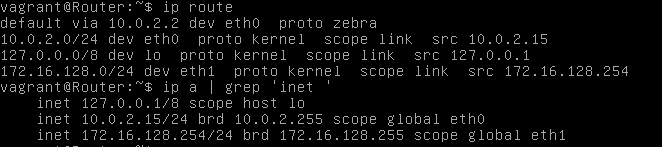

# Infrastructure Automation Laboverslag - Troubleshooting 2

- Student: Ismail Karakaya
- Klasgroep: TIN-TI/G3.B
- Panopto opname: https://hogent.cloud.panopto.eu/Panopto/Pages/Viewer.aspx?id=fe15a7bc-522c-442b-9731-ae070125f7af

## Instructies

## Verslag

- Verwachte IP addressering voor onze machines:

| Host | Interface | IP |VBox Interface |
| -- | -- | -- | -- |
| router | eth0 | 10.0.2.15/24 (DHCP) | NAT |
| | eth1 | 172.16.128.254/24 | intnet |
| server | eth0 | 10.0.2.15/24 (DHCP) | NAT
| | eth1 | 172.16.128.2/24 | intnet |
| workstation | eth0 | - | Uitgeschakeld (NAT) |
| | eth1 | 172.16.128.101-254 | intnet|


### Router

#### Laag 1: Physical Layer

1. We bekijken de configuraties van onze adapter op VirtualBox.

   - Adapter 1: NAT
     - Ingesteld als NAT
     - Cable Connected staat aan


   - Adapter 2: Internal
     - Cable connected staat aan


#### Laag 2: Network Access

1. SSHen naar de router via `vagrant ssh router` lukt niet, dus gaan we binnen de VM via de Virtualbox GUI.


2. We voeren het commando `ip link` uit om onze adapters te bekijken.


- We hebben de volgende adapters:
  - LO: loopback
  - eth0: NAT
  - eth1: Internal

- BROADCAST toont aan dat onze adapters up en running zijn.

#### Laag 3: Internet Layer

| Host | Interface | IP |VBox Interface |
| -- | -- | -- | -- |
| router | eth0 | 10.0.2.15/24 (DHCP) | NAT |
| | eth1 | 172.16.128.254/24 | intnet |

1. We bekijken de IP addressering van de router in `vagrant-hosts.yml`.

```console
---

- name: router
  ip: 172.16.128.254
  netmask: 255.255.192.0
  intnet: true
  box: bertvv/vyos116

- name: server
  ip: 172.16.0.2
  intnet: true
  box: bento/almalinux-8

- name: workstation
  intnet: true
  box: bento/almalinux-8
```

- We zien dat de subnetmask van de router verkeerd staat. We moeten het veranderen naar `255.255.255.0`


2. We veranderen de subnetmask van de router naar `255.255.255.0`.

```console
---

- name: router
  ip: 172.16.128.254
  netmask: 255.255.255.0
  intnet: true
  box: bertvv/vyos116

- name: server
  ip: 172.16.0.2
  intnet: true
  box: bento/almalinux-8

- name: workstation
  intnet: true
  box: bento/almalinux-8
```

3. We bekijken ook de `router.sh` of dat de IP addressen daar juist zijn.

```console
#------------------------------------------------------------------------------
# IP settings
#------------------------------------------------------------------------------

set interfaces ethernet eth0 description 'WAN'
set interfaces ethernet eth0 address dhcp

set interfaces ethernet eth1 description 'LAN'
set interfaces ethernet eth1 address 172.16.128.254/24

set system gateway-address 10.0.2.2
set system name-server 172.16.128.254

#------------------------------------------------------------------------------
# Network Address Translation
#------------------------------------------------------------------------------

set nat source rule 100 outbound-interface 'eth0'
set nat source rule 100 source address '172.16.128.0/24'
set nat source rule 100 translation address 'masquerade'

```

- De IP addressen zijn juist.

4. We gebruiken het commando `ip address` om de netwerk interfaces te analyzeren.


- lo:
  - IPv4: 127.0.0.1/8
  - Loopback interface correct configureerd

- eth0 (NAT):
  - BROADCAST
  - IPv4: 10.0.2.15/24
  - Krijgt automatisch een IP van DHCP

- eth1 (Internal):
  - BROADCAST
  - 172.16.128.254/24
  - We zien dat we de juiste IP address en subnetmask hebben. 


5. We vergelijken output van `ip route` en `ip address` om te zien of dat de routing table in de correcte subnet ligt.



| | ip route | ip address |
| -- | -- | -- |
| eth0 | 10.0.2.125/24 | 10.0.2.15/24 |
| eth1 | 172.16.128.254/24 | 172.16.128.254/24 |

- De adressen zijn correct en behoren in dezelfde subnet. 

6. We pingen naar de buitenwereld.


- Ping Router > Buitenwereld & `curl icanhazip.com`


- Onze router kan de buitenwereld bereiken.


### Server

#### Laag 1: Physical Layer

1. We bekijken de configuraties van onze adapter op VirtualBox.

   - Adapter 1: NAT
     - Ingesteld als NAT
     - Cable Connected staat aan


   - Adapter 2: Internal
     - Cable connected staat aan


#### Laag 2: Network Access

1. We gaan SSHen naar de machine met het commando `vagrant ssh server`.

```console
$ vagrant ssh server

This system is built by the Bento project by Chef Software
More information can be found at https://github.com/chef/bento
Last login: Wed Dec 22 13:28:18 2021 from 10.0.2.2
[vagrant@server ~]$
```

2. We voeren het commando `ip link` uit om onze adapters te bekijken.

```console
[vagrant@server ~]$ ip link
1: lo: <LOOPBACK,UP,LOWER_UP> mtu 65536 qdisc noqueue state UNKNOWN mode DEFAULT group default qlen 1000
    link/loopback 00:00:00:00:00:00 brd 00:00:00:00:00:00
2: eth0: <BROADCAST,MULTICAST,UP,LOWER_UP> mtu 1500 qdisc fq_codel state UP mode DEFAULT group default qlen 1000
    link/ether 08:00:27:bb:4f:a7 brd ff:ff:ff:ff:ff:ff
3: eth1: <BROADCAST,MULTICAST,UP,LOWER_UP> mtu 1500 qdisc fq_codel state UP mode DEFAULT group default qlen 1000
    link/ether 08:00:27:da:8e:de brd ff:ff:ff:ff:ff:ff
```

- We hebben de volgende adapters:
  - LO: loopback
  - eth0: NAT
  - eth1: Internal

- BROADCAST toont aan dat onze adapters up en running zijn.

#### Laag 3: Internet Layer

We moeten deze IP addressen hebben voor `server`:

| Host | Interface | IP | VBox Interface | 
| -- | -- | -- | -- |
| server | eth0 | 10.0.2.15/24 (DHCP) | NAT | 
| | eth1 | 172.16.128.2/24 | intnet |

1. We bekijken de IP addressering van de server in `vagrant-hosts.yml`.

```console
- name: router
  ip: 172.16.128.254
  netmask: 255.255.192.0
  intnet: true
  box: bertvv/vyos116

- name: server
  ip: 172.16.0.2
  intnet: true
  box: bento/almalinux-8

- name: workstation
  intnet: true
  box: bento/almalinux-8
```

- De IP address is fout. We moeten het wijzigen naar `172.16.128.2`


2. We veranderen de IP address van de server naar `172.16.128.2`.

```console
---

- name: router
  ip: 172.16.128.254
  netmask: 255.255.255.0
  intnet: true
  box: bertvv/vyos116

- name: server
  ip: 172.16.128.2
  intnet: true
  box: bento/almalinux-8

- name: workstation
  intnet: true
  box: bento/almalinux-8
```

3. We gebruiken het commando `ip address` om de netwerk interfaces te analyzeren.

```console
[vagrant@server ~]$ ip address
1: lo: <LOOPBACK,UP,LOWER_UP> mtu 65536 qdisc noqueue state UNKNOWN group default qlen 1000
    link/loopback 00:00:00:00:00:00 brd 00:00:00:00:00:00
    inet 127.0.0.1/8 scope host lo
       valid_lft forever preferred_lft forever
    inet6 ::1/128 scope host
       valid_lft forever preferred_lft forever
2: eth0: <BROADCAST,MULTICAST,UP,LOWER_UP> mtu 1500 qdisc fq_codel state UP group default qlen 1000
    link/ether 08:00:27:bb:4f:a7 brd ff:ff:ff:ff:ff:ff
    inet 10.0.2.15/24 brd 10.0.2.255 scope global dynamic noprefixroute eth0
       valid_lft 85865sec preferred_lft 85865sec
    inet6 fe80::416b:91b7:2573:7824/64 scope link noprefixroute
       valid_lft forever preferred_lft forever
3: eth1: <BROADCAST,MULTICAST,UP,LOWER_UP> mtu 1500 qdisc fq_codel state UP group default qlen 1000
    link/ether 08:00:27:da:f5:20 brd ff:ff:ff:ff:ff:ff
    inet 172.16.128.2/24 brd 172.16.128.255 scope global noprefixroute eth1
       valid_lft forever preferred_lft forever
    inet6 fe80::a00:27ff:feda:f520/64 scope link
       valid_lft forever preferred_lft forever
```

- lo:
  - IPv4: 127.0.0.1/8
  - Loopback interface correct configureerd

- eth0 (NAT):
  - BROADCAST
  - IPv4: 10.0.2.15/24
  - Krijgt automatisch een IP van DHCP
  - Correct configureerd

- eth1 (Internal):
  - BROADCAST
  - 172.16.128.2/24
  - Correct configureerd


4. We vergelijken output van `ip route` en `ip address` om te zien of dat de routing table in de correcte subnet ligt.

```console
[vagrant@server ~]$ ip a | grep 'inet '
    inet 127.0.0.1/8 scope host lo
    inet 10.0.2.15/24 brd 10.0.2.255 scope global dynamic noprefixroute eth0
    inet 172.16.128.2/24 brd 172.16.128.255 scope global noprefixroute eth1
[vagrant@server ~]$ ip r
default via 10.0.2.2 dev eth0 proto dhcp metric 100
10.0.2.0/24 dev eth0 proto kernel scope link src 10.0.2.15 metric 100
172.16.128.0/24 dev eth1 proto kernel scope link src 172.16.128.2 metric 101
```

| | ip route | ip address |
| -- | -- | -- |
| eth0 | 10.0.2.15/24 | 10.0.2.15/24 |
| eth1 | 172.16.128.2/24 | 172.16.128.2/24 |

- De adressen zijn correct en behoren in dezelfde subnet. 

5. We controleren de config files van onze interfaces.

- eth0

```console
[vagrant@server ~]$ sudo cat /etc/sysconfig/network-scripts/ifcfg-eth0
TYPE=Ethernet
PROXY_METHOD=none
BROWSER_ONLY=no
BOOTPROTO=dhcp
DEFROUTE=yes
IPV4_FAILURE_FATAL=no
IPV6INIT=yes
IPV6_AUTOCONF=yes
IPV6_DEFROUTE=yes
IPV6_FAILURE_FATAL=no
IPV6_ADDR_GEN_MODE=stable-privacy
NAME=eth0
DEVICE=eth0
ONBOOT=yes
```

- Alles is in orde. 

- eth1

```console
[vagrant@server ~]$ sudo cat /etc/sysconfig/network-scripts/ifcfg-eth1
#VAGRANT-BEGIN
# The contents below are automatically generated by Vagrant. Do not modify.
NM_CONTROLLED=yes
BOOTPROTO=none
ONBOOT=yes
IPADDR=172.16.128.2
NETMASK=255.255.255.0
DEVICE=eth1
PEERDNS=no
#VAGRANT-END
TYPE=Ethernet
PROXY_METHOD=none
BROWSER_ONLY=no
PREFIX=24
DEFROUTE=yes
IPV4_FAILURE_FATAL=no
RES_OPTIONS=single-request-reopen
IPV6INIT=no
NAME="System eth1"
UUID=9c92fad9-6ecb-3e6c-eb4d-8a47c6f50c04
```

- Alles is in orde.


6. We restarten de `network services` voor zekerheid

```console
[vagrant@server network-scripts]$ sudo systemctl restart network
```

7. We pingen naar de buitenwereld.


- Ping Server > Buitenwereld & `curl icanhazip.com`

```console
[vagrant@server ~]$ ping 8.8.8.8
PING 8.8.8.8 (8.8.8.8) 56(84) bytes of data.
64 bytes from 8.8.8.8: icmp_seq=1 ttl=117 time=18.6 ms
64 bytes from 8.8.8.8: icmp_seq=2 ttl=117 time=16.7 ms
64 bytes from 8.8.8.8: icmp_seq=3 ttl=117 time=19.0 ms
^C
--- 8.8.8.8 ping statistics ---
3 packets transmitted, 3 received, 0% packet loss, time 2005ms
rtt min/avg/max/mdev = 16.740/18.112/19.016/0.998 ms

[vagrant@server ~]$ curl icanhazip.com
193.121.54.175

```

#### Laag 4: Transport Layer

##### DNS

1. We controleren of de service `dnsmasq` actief staat.

```console
[vagrant@server ~]$ sudo systemctl status dnsmasq
● dnsmasq.service - DNS caching server.
   Loaded: loaded (/usr/lib/systemd/system/dnsmasq.service; enabled; vendor preset: disabled)
   Active: inactive (dead)
```

- DNS service staat inactive.

2. We controleren de configfile `/etc/hosts`.
```console
[vagrant@server network-scripts]$ sudo cat /etc/hosts
172.16.0.2      server server.linuxlab.lan www.linuxlab.lan
172.16.128.254  gateway router gateway.linuxlab.lan router.linuxlab.lan
127.0.0.1     localhost localhost.localdomain localhost4 localhost4.localdomain4
::1           localhost localhost.localdomain localhost6 localhost6.localdomain6
```

- IP address van server staat verkeerd. We moeten het wijzigen naar `172.16.128.2`

3. We wijzigen den IP address van de server naar `172.16.128.2` in de configfile `/etc/hosts`.

```console
[vagrant@server ~]$ sudo cat /etc/hosts
172.16.128.2      server server.linuxlab.lan www.linuxlab.lan
172.16.128.254  gateway router gateway.linuxlab.lan router.linuxlab.lan
127.0.0.1     localhost localhost.localdomain localhost4 localhost4.localdomain4
::1           localhost localhost.localdomain localhost6 localhost6.localdomain6
```

4. We controleren vervolgens de configfile `etc/resolv.conf`.

```console
[vagrant@server network-scripts]$ sudo cat /etc/resolv.conf
# Generated by NetworkManager
search lan
nameserver 10.0.2.3
options single-request-reopen
```

5. We starten de `dnsmasq` service.


```console
[vagrant@server ~]$ sudo systemctl start dnsmasq

[vagrant@server ~]$ sudo systemctl status dnsmasq
● dnsmasq.service - DNS caching server.
   Loaded: loaded (/usr/lib/systemd/system/dnsmasq.service; enabled; vendor preset: disabled)
   Active: active (running) since Wed 2021-12-22 16:09:41 UTC; 1min 18s ago
 Main PID: 6355 (dnsmasq)
    Tasks: 1 (limit: 4949)
   Memory: 700.0K
   CGroup: /system.slice/dnsmasq.service
           └─6355 /usr/sbin/dnsmasq -k

Dec 22 16:09:41 server systemd[1]: Started DNS caching server..
Dec 22 16:09:41 server dnsmasq[6355]: started, version 2.79 cachesize 150
Dec 22 16:09:41 server dnsmasq[6355]: compile time options: IPv6 GNU-getopt DBus no-i18n IDN2 DHCP DHCPv6 no-Lua>
Dec 22 16:09:41 server dnsmasq[6355]: reading /etc/resolv.conf
Dec 22 16:09:41 server dnsmasq[6355]: using nameserver 10.0.2.3#53
Dec 22 16:09:41 server dnsmasq[6355]: read /etc/hosts - 4 addresses
```

6. We controleren of dat de service luistert naar de correcte poorten/interfaces.

```console
[vagrant@server ~]$ sudo ss -tulnp | grep 'dnsmasq'
udp   UNCONN 0      0            0.0.0.0:53        0.0.0.0:*    users:(("dnsmasq",pid=5916,fd=4))
udp   UNCONN 0      0               [::]:53           [::]:*    users:(("dnsmasq",pid=5916,fd=6))
tcp   LISTEN 0      32           0.0.0.0:53        0.0.0.0:*    users:(("dnsmasq",pid=5916,fd=5))
tcp   LISTEN 0      32              [::]:53           [::]:*    users:(("dnsmasq",pid=5916,fd=7))
```

7. We controleren of dat de firewall de `dns` services doorlaat.

```console
[vagrant@server ~]$ sudo firewall-cmd --list-all
public (active)
  target: default
  icmp-block-inversion: no
  interfaces: eth0 eth1
  sources:
  services: cockpit dhcpv6-client dns http ssh
  ports: 67/tcp
  protocols:
  masquerade: no
  forward-ports:
  source-ports:
  icmp-blocks:
  rich rules:
```

- Firewall laat `dns` services door.

##### DHCP

1. We controleren of de service `dhcpd` actief staat.

```console
[vagrant@server ~]$ sudo systemctl status dhcpd
● dhcpd.service - DHCPv4 Server Daemon
   Loaded: loaded (/usr/lib/systemd/system/dhcpd.service; enabled; vendor preset: disabled)
   Active: inactive (dead)
     Docs: man:dhcpd(8)
           man:dhcpd.conf(5)
```

- `dhcpd` service staat uit. 


2. We starten de `dhcpd` service.

```console
[vagrant@server ~]$ sudo systemctl start dhcpd
Job for dhcpd.service failed because the control process exited with error code.
See "systemctl status dhcpd.service" and "journalctl -xe" for details.

[vagrant@server ~]$ systemctl status dhcpd
● dhcpd.service - DHCPv4 Server Daemon
   Loaded: loaded (/usr/lib/systemd/system/dhcpd.service; enabled; vendor preset: disabled)
   Active: failed (Result: exit-code) since Wed 2021-12-22 16:16:05 UTC; 11s ago
     Docs: man:dhcpd(8)
           man:dhcpd.conf(5)
  Process: 6384 ExecStart=/usr/sbin/dhcpd -f -cf /etc/dhcp/dhcpd.conf -user dhcpd -group dhcpd --no-pid $DHCPDARGS (code=exited, status=1/FAILURE)
 Main PID: 6384 (code=exited, status=1/FAILURE)
```

- Starten van `dhcpd` service faalt. 

3. We gebruiken het commando `journalctl -xe` om de fouten op te sporen.

```console
[vagrant@server ~]$ sudo journalctl -xe
Dec 22 16:12:24 server sudo[6360]: pam_unix(sudo:session): session opened for user root by vagrant(uid=0)
Dec 22 16:12:25 server sudo[6360]: pam_unix(sudo:session): session closed for user root
Dec 22 16:12:28 server sudo[6369]:  vagrant : TTY=pts/0 ; PWD=/home/vagrant ; USER=root ; COMMAND=/sbin/ss -tulnp
Dec 22 16:12:28 server sudo[6369]: pam_systemd(sudo:session): Cannot create session: Already running in a session or user slice
Dec 22 16:12:28 server sudo[6369]: pam_unix(sudo:session): session opened for user root by vagrant(uid=0)
Dec 22 16:12:28 server sudo[6369]: pam_unix(sudo:session): session closed for user root
Dec 22 16:12:41 server sudo[6373]:  vagrant : TTY=pts/0 ; PWD=/home/vagrant ; USER=root ; COMMAND=/sbin/ss -tulnp
Dec 22 16:12:41 server sudo[6373]: pam_systemd(sudo:session): Cannot create session: Already running in a session or user slice
Dec 22 16:12:41 server sudo[6373]: pam_unix(sudo:session): session opened for user root by vagrant(uid=0)
Dec 22 16:12:41 server sudo[6373]: pam_unix(sudo:session): session closed for user root
Dec 22 16:13:52 server sudo[6377]:  vagrant : TTY=pts/0 ; PWD=/home/vagrant ; USER=root ; COMMAND=/bin/firewall-cmd --list-all
Dec 22 16:13:52 server sudo[6377]: pam_systemd(sudo:session): Cannot create session: Already running in a session or user slice
Dec 22 16:13:52 server sudo[6377]: pam_unix(sudo:session): session opened for user root by vagrant(uid=0)
Dec 22 16:13:52 server sudo[6377]: pam_unix(sudo:session): session closed for user root
Dec 22 16:16:04 server sudo[6380]:  vagrant : TTY=pts/0 ; PWD=/home/vagrant ; USER=root ; COMMAND=/bin/systemctl start dhcpd
Dec 22 16:16:05 server sudo[6380]: pam_systemd(sudo:session): Cannot create session: Already running in a session or user slice
Dec 22 16:16:05 server sudo[6380]: pam_unix(sudo:session): session opened for user root by vagrant(uid=0)
Dec 22 16:16:05 server systemd[1]: Starting DHCPv4 Server Daemon...
-- Subject: Unit dhcpd.service has begun start-up
-- Defined-By: systemd
-- Support: https://access.redhat.com/support
--
-- Unit dhcpd.service has begun starting up.
Dec 22 16:16:05 server dhcpd[6384]: Internet Systems Consortium DHCP Server 4.3.6
Dec 22 16:16:05 server dhcpd[6384]: Copyright 2004-2017 Internet Systems Consortium.
Dec 22 16:16:05 server dhcpd[6384]: All rights reserved.
Dec 22 16:16:05 server dhcpd[6384]: For info, please visit https://www.isc.org/software/dhcp/
Dec 22 16:16:05 server dhcpd[6384]: bad range, address 172.16.128.101 not in subnet 172.16.0.0 netmask 255.255.255.0
Dec 22 16:16:05 server dhcpd[6384]:
Dec 22 16:16:05 server dhcpd[6384]: This version of ISC DHCP is based on the release available
Dec 22 16:16:05 server dhcpd[6384]: on ftp.isc.org. Features have been added and other changes
Dec 22 16:16:05 server dhcpd[6384]: have been made to the base software release in order to make
Dec 22 16:16:05 server dhcpd[6384]: it work better with this distribution.
Dec 22 16:16:05 server dhcpd[6384]:
Dec 22 16:16:05 server dhcpd[6384]: Please report issues with this software via:
Dec 22 16:16:05 server dhcpd[6384]: https://bugs.almalinux.org/
Dec 22 16:16:05 server dhcpd[6384]:
Dec 22 16:16:05 server dhcpd[6384]: exiting.
Dec 22 16:16:05 server systemd[1]: dhcpd.service: Main process exited, code=exited, status=1/FAILURE
Dec 22 16:16:05 server systemd[1]: dhcpd.service: Failed with result 'exit-code'.
-- Subject: Unit failed
-- Defined-By: systemd
-- Support: https://access.redhat.com/support
--
-- The unit dhcpd.service has entered the 'failed' state with result 'exit-code'.
Dec 22 16:16:05 server systemd[1]: Failed to start DHCPv4 Server Daemon.
-- Subject: Unit dhcpd.service has failed
-- Defined-By: systemd
-- Support: https://access.redhat.com/support
--
-- Unit dhcpd.service has failed.
--
-- The result is failed.
Dec 22 16:16:05 server sudo[6380]: pam_unix(sudo:session): session closed for user root
Dec 22 16:17:44 server sudo[6390]:  vagrant : TTY=pts/0 ; PWD=/home/vagrant ; USER=root ; COMMAND=/bin/journalctl -xe
Dec 22 16:17:44 server sudo[6390]: pam_systemd(sudo:session): Cannot create session: Already running in a session or user slice
Dec 22 16:17:44 server sudo[6390]: pam_unix(sudo:session): session opened for user root by vagrant(uid=0)
```

- We zien dat de address range die meegegeven is niet in de juiste subnet zit.

4. We bekijken de config file in `/etc/dhcp/dhcpd.conf`

```console
[vagrant@server ~]$ sudo cat /etc/dhcp/dhcpd.conf
# dhcpd.conf -- linuxlab.lan

authoritative;

subnet 172.16.0.0 netmask 255.255.255.0 {
  range 172.16.128.101 172.20.0.253;

  option domain-name "linuxlab.lan";
  option routers 10.0.2.2;
  option domain-name-servers 8.8.4.4;

  default-lease-time 14400;
  max-lease-time 21600;
}
```

5. We wijzigen de subnet, address range, routers address en domain-name-servers address.

- subnet: `172.16.128.0`
- address range: `172.16.128.101` tot `172.16.128.253`
- option routers: `172.16.128.254`
- option domain-name-servers: `172.16.128.2`

```console
[vagrant@server ~]$ sudo cat /etc/dhcp/dhcpd.conf
# dhcpd.conf -- linuxlab.lan

authoritative;

subnet 172.16.128.0 netmask 255.255.255.0 {
  range 172.16.128.101 172.16.128.253;

  option domain-name "linuxlab.lan";
  option routers 172.16.128.254;
  option domain-name-servers 172.16.128.2;

  default-lease-time 14400;
  max-lease-time 21600;
}
```

6. We proberen de service te heropstarten.

```console
[vagrant@server ~]$ sudo systemctl start dhcpd
[vagrant@server ~]$ sudo systemctl status dhcpd
● dhcpd.service - DHCPv4 Server Daemon
   Loaded: loaded (/usr/lib/systemd/system/dhcpd.service; enabled; vendor preset: disabled)
   Active: active (running) since Thu 2021-12-23 16:28:01 UTC; 5s ago
     Docs: man:dhcpd(8)
           man:dhcpd.conf(5)
 Main PID: 5969 (dhcpd)
   Status: "Dispatching packets..."
    Tasks: 1 (limit: 4949)
   Memory: 4.9M
   CGroup: /system.slice/dhcpd.service
           └─5969 /usr/sbin/dhcpd -f -cf /etc/dhcp/dhcpd.conf -user dhcpd -group dhcpd --no-pid

Dec 23 16:28:01 server dhcpd[5969]:    you want, please write a subnet declaration
Dec 23 16:28:01 server dhcpd[5969]:    in your dhcpd.conf file for the network segment
Dec 23 16:28:01 server dhcpd[5969]:    to which interface eth0 is attached. **
Dec 23 16:28:01 server dhcpd[5969]:
Dec 23 16:28:01 server dhcpd[5969]: Sending on   Socket/fallback/fallback-net
Dec 23 16:28:01 server dhcpd[5969]: Server starting service.
Dec 23 16:28:04 server dhcpd[5969]: DHCPDISCOVER from 08:00:27:82:ac:cc via eth1
Dec 23 16:28:05 server dhcpd[5969]: DHCPOFFER on 172.16.128.101 to 08:00:27:82:ac:cc (workstation) via eth1
Dec 23 16:28:05 server dhcpd[5969]: DHCPREQUEST for 172.16.128.101 (172.16.128.2) from 08:00:27:82:ac:cc (wo>
Dec 23 16:28:05 server dhcpd[5969]: DHCPACK on 172.16.128.101 to 08:00:27:82:ac:cc (workstation) via eth1
```

- Opstarten van `dhcpd` service is gelukt.

7. We controleren of dat de service luistert naar de correcte poorten/interfaces.

```console
[vagrant@server ~]$ sudo ss -tulnp | grep 'dhcpd'
udp   UNCONN 0      0            0.0.0.0:67        0.0.0.0:*    users:(("dhcpd",pid=6439,fd=10)) 
```

8. We controleren of dat de firewall de `dhcpd` services doorlaat.

```console
[vagrant@server ~]$ sudo firewall-cmd --list-all
public (active)
  target: default
  icmp-block-inversion: no
  interfaces: eth0 eth1
  sources:
  services: cockpit dhcpv6-client dns http ssh
  ports: 67/tcp
  protocols:
  masquerade: no
  forward-ports:
  source-ports:
  icmp-blocks:
  rich rules:
```

- `dhcp` service staat er niet tussen

9. We passen de firewall aan zodat `dhcp` service toegelaten wordt.

```console
[vagrant@server ~]$ sudo firewall-cmd --add-service=dhcp --permanent
success

[vagrant@server ~]$ sudo firewall-cmd --reload
success

[vagrant@server ~]$ sudo firewall-cmd --list-all
public (active)
  target: default
  icmp-block-inversion: no
  interfaces: eth0 eth1
  sources:
  services: cockpit dhcp dhcpv6-client dns http ssh
  ports: 67/tcp
  protocols:
  masquerade: no
  forward-ports:
  source-ports:
  icmp-blocks:
  rich rules:
```

##### Website

1. We controleren of de service `httpd` actief staat.

```console
[vagrant@server ~]$ sudo systemctl status httpd
● httpd.service - The Apache HTTP Server
   Loaded: loaded (/usr/lib/systemd/system/httpd.service; enabled; vendor preset: disabled)
   Active: active (running) since Wed 2021-12-22 13:19:17 UTC; 2h 42min ago
     Docs: man:httpd.service(8)
 Main PID: 5382 (httpd)
   Status: "Running, listening on: port 80"
    Tasks: 213 (limit: 4949)
   Memory: 24.8M
   CGroup: /system.slice/httpd.service
           ├─5382 /usr/sbin/httpd -DFOREGROUND
           ├─5385 /usr/sbin/httpd -DFOREGROUND
           ├─5386 /usr/sbin/httpd -DFOREGROUND
           ├─5387 /usr/sbin/httpd -DFOREGROUND
           └─5388 /usr/sbin/httpd -DFOREGROUND

Dec 22 13:19:16 server systemd[1]: Starting The Apache HTTP Server...
Dec 22 13:19:17 server httpd[5382]: AH00558: httpd: Could not reliably determine the server's>
Dec 22 13:19:17 server systemd[1]: Started The Apache HTTP Server.
Dec 22 13:19:17 server httpd[5382]: Server configured, listening on: port 80
```

- `httpd` service staat aan.

2. We controleren of dat de `httpd` service luistert naar de correcte poorten/interfaces.

```console
[vagrant@server ~]$ sudo ss -tulnp | grep 'httpd'
tcp   LISTEN 0      128                *:80              *:*    users:(("httpd",pid=1118,fd=4),("httpd",pid=1117,fd=4),("httpd",pid=1116,fd=4),("httpd",pid=992,fd=4)) 
```

3. We controleren of dat de firewall de `httpd` services doorlaat.

```console
[vagrant@server ~]$ sudo firewall-cmd --list-all
public (active)
  target: default
  icmp-block-inversion: no
  interfaces: eth0 eth1
  sources:
  services: cockpit dhcp dhcpv6-client dns http ssh
  ports: 67/tcp
  protocols:
  masquerade: no
  forward-ports:
  source-ports:
  icmp-blocks:
  rich rules:
```

### Werkstation

#### Laag 1: Phyiscal Layer

1. We bekijken de configuraties van onze adapter op VirtualBox.

   - Adapter 1: NAT
     - Ingesteld als NAT
     - **We moeten NAT uitschakelen: Cable Connected wegvinken**


   - Adapter 2: Internal
     - Cable connected staat aan


#### Laag 2: Network Access Layer

1. We controleren de state van de interfaces met `ip link`.


- eth0
  - NO-CARRIER
  - Juist

- eth1
  - BROADCAST
  - Juist

#### Laag 3: Internet Layer

| Host | Interface | IP |VBox Interface |
| -- | -- | -- | -- |
| workstation | eth0 | - | Uitgeschakeld (NAT) |
| | eth1 | 172.16.128.101-254/24 | intnet|

1. We controleren of dat de host de juiste IP address heeft ontvangen met `ip address`.


- eth1
  - IP: 172.16.0.101/24
  - Correct

2. We pingen naar de buitenwereld, router VM, server VM, www.linuxlab.lan

- Workstation > Buitenwereld (Succes)
 


- Workstation > Router (Succes)


- Workstation > Server (Succes)


- Workstation > www.linuxlab.lan


## Eindresultaat


## Referenties

Lijst bronnen van nuttige informatie op die je gebruikt hebt voor het vervolledigen van deze labo-opdracht: boeken, handleidingen, websites, ...
